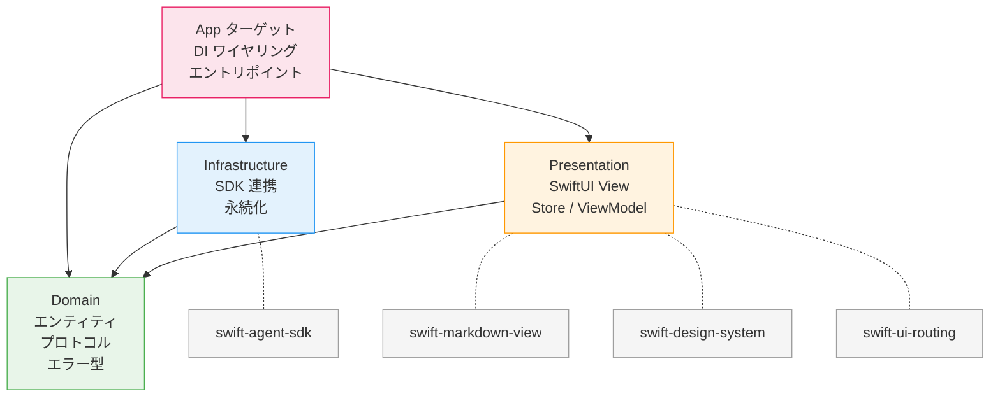

# 全体アーキテクチャ

## 1. アーキテクチャパターン

**Pattern B: ローカル SPM パッケージ分割** を採用する。

4 パッケージ（Domain / Infrastructure / Presentation）+ App ターゲットで構成し、
SPM パッケージ境界によりコンパイル時に依存方向を強制する。

## 2. パッケージ依存図



### 依存方向ルール

| パッケージ | 内部依存 | 外部依存 | 責務 |
|-----------|---------|---------|------|
| **Domain** | なし | なし（Foundation のみ） | エンティティ、プロトコル、エラー型、値オブジェクト |
| **Infrastructure** | Domain | swift-agent-sdk | Domain プロトコル実装、SDK 連携、JSON 永続化 |
| **Presentation** | Domain | swift-markdown-view, swift-design-system, swift-ui-routing | SwiftUI View、Store（ViewModel） |
| **App** | Domain + Infrastructure + Presentation | なし | DI ワイヤリング、@main エントリポイント、entitlements |

**禁止事項:**
- Domain は何にも依存しない
- Infrastructure と Presentation は互いに依存しない
- App 以外のパッケージから Infrastructure と Presentation を同時に参照しない

## 3. プロジェクト構成

```
SampleApp/
├── ClaudeAgent/                          ← XcodeGen 管理プロジェクト
│   ├── project.yml                       ← 唯一の真実の源
│   ├── Makefile                          ← ビルド / テストコマンド
│   ├── .gitignore                        ← *.xcodeproj を除外
│   │
│   ├── Packages/
│   │   ├── Domain/                       ← ドメイン層
│   │   │   ├── Package.swift
│   │   │   ├── Sources/Domain/
│   │   │   └── Tests/DomainTests/
│   │   │
│   │   ├── Infrastructure/               ← インフラ層
│   │   │   ├── Package.swift
│   │   │   ├── Sources/Infrastructure/
│   │   │   └── Tests/InfrastructureTests/
│   │   │
│   │   └── Presentation/                 ← プレゼンテーション層
│   │       ├── Package.swift
│   │       ├── Sources/Presentation/
│   │       └── Tests/PresentationTests/
│   │
│   ├── App/                              ← 合成ルート（Xcode ターゲット）
│   │   └── Sources/
│   │       └── ClaudeAgentApp.swift       ← @main エントリポイント
│   │
│   └── Resources/
│       └── Assets.xcassets
│
└── specs/                                ← 仕様書（本ファイル群）
```

## 4. project.yml（XcodeGen）

```yaml
name: ClaudeAgent
options:
  bundleIdPrefix: dev.noproblem
  deploymentTarget:
    macOS: "15.0"
  xcodeVersion: "16.0"
  createIntermediateGroups: true
  defaultConfig: Debug

settings:
  base:
    SWIFT_VERSION: "6.0"
    MACOSX_DEPLOYMENT_TARGET: "15.0"
    SWIFT_STRICT_CONCURRENCY: complete

# ローカル SPM パッケージ（Pattern B の核心）
localPackages:
  - Packages/Domain
  - Packages/Infrastructure
  - Packages/Presentation

targets:
  ClaudeAgent:
    type: application
    platform: macOS
    sources:
      - path: App/Sources
    resources:
      - path: Resources
    entitlements:
      path: App/ClaudeAgent.entitlements
      properties:
        com.apple.security.app-sandbox: false
    settings:
      base:
        INFOPLIST_KEY_LSApplicationCategoryType: "public.app-category.developer-tools"
        PRODUCT_BUNDLE_IDENTIFIER: dev.noproblem.ClaudeAgent
        PRODUCT_NAME: ClaudeAgent
        GENERATE_INFOPLIST_FILE: true
        CURRENT_PROJECT_VERSION: 1
        MARKETING_VERSION: 0.1.0
    dependencies:
      - package: Domain
      - package: Infrastructure
      - package: Presentation
```

> **注意**: `packages` セクションは使用しない。外部依存は各 Package.swift で管理する。
> entitlements は `properties` で宣言的に管理し、.entitlements ファイルは直接編集しない。

## 5. Makefile

```makefile
.PHONY: generate build test clean

generate:
	xcodegen generate

build: build-domain build-infrastructure build-presentation build-app

build-domain:
	swift build --package-path Packages/Domain

build-infrastructure:
	swift build --package-path Packages/Infrastructure

build-presentation:
	swift build --package-path Packages/Presentation

build-app: generate
	xcodebuild build -project ClaudeAgent.xcodeproj -scheme ClaudeAgent -destination 'platform=macOS'

test: test-domain test-infrastructure test-presentation

test-domain:
	swift test --package-path Packages/Domain

test-infrastructure:
	swift test --package-path Packages/Infrastructure

test-presentation:
	swift test --package-path Packages/Presentation

clean:
	rm -rf .build DerivedData
	swift package clean --package-path Packages/Domain
	swift package clean --package-path Packages/Infrastructure
	swift package clean --package-path Packages/Presentation
```

## 6. DI 方針

App ターゲットが合成ルート（Composition Root）として機能する。

```swift
// App/Sources/ClaudeAgentApp.swift
@main
struct ClaudeAgentApp: App {
    @State private var appState: AppState

    init() {
        // Infrastructure 実装の生成
        let agentService = AgentService()        // Infrastructure
        let sessionStore = JSONSessionStore()     // Infrastructure

        // Presentation Store への DI
        _appState = State(initialValue: AppState(
            agentService: agentService,
            sessionStore: sessionStore
        ))
    }

    var body: some Scene {
        WindowGroup {
            ContentView(appState: appState)
        }
    }
}
```

**DI の流れ:**
1. App が Infrastructure の具体型を生成
2. Domain プロトコル型として Presentation の Store に注入
3. Presentation は Domain プロトコルのみに依存（Infrastructure を知らない）

## 更新履歴

| 日付 | 変更内容 |
|------|---------|
| 2026-02-08 | 初版作成 |
| 2026-02-08 | Pattern B（4 パッケージ分割）で全面リライト |
