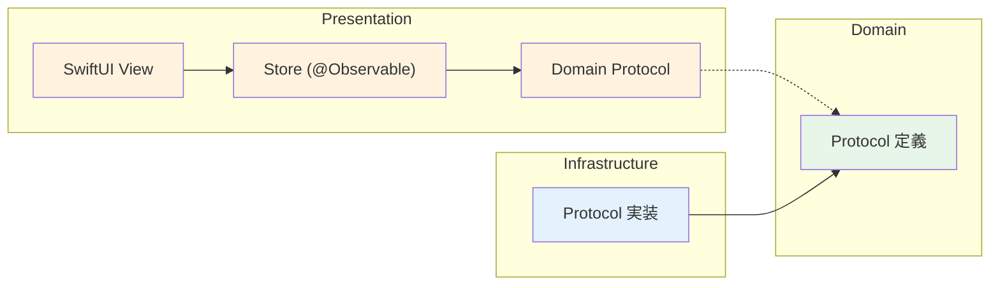

# レイヤー別アーキテクチャ

## 1. Domain パッケージ

### 1.1 責務

- エンティティ（データモデル）の定義
- サービスプロトコルの定義（AgentServiceProtocol, SessionStoreProtocol）
- エラー型の定義
- 値オブジェクト（ModelSelection, SessionStatus）

### 1.2 Package.swift

```swift
// swift-tools-version: 6.0
import PackageDescription

let package = Package(
    name: "Domain",
    platforms: [.macOS(.v15)],
    products: [
        .library(name: "Domain", targets: ["Domain"]),
    ],
    targets: [
        .target(name: "Domain"),
        .testTarget(name: "DomainTests", dependencies: ["Domain"]),
    ]
)
```

### 1.3 ディレクトリ構成

```
Packages/Domain/
├── Package.swift
├── Sources/Domain/
│   ├── Entities/
│   │   ├── ChatMessage.swift
│   │   ├── ContentItem.swift
│   │   ├── SessionConfig.swift
│   │   ├── SessionData.swift
│   │   └── TokenUsage.swift
│   ├── ValueObjects/
│   │   ├── ModelSelection.swift
│   │   └── SessionStatus.swift
│   ├── Protocols/
│   │   ├── AgentServiceProtocol.swift
│   │   └── SessionStoreProtocol.swift
│   └── Errors/
│       └── AppError.swift
└── Tests/DomainTests/
    ├── ChatMessageTests.swift
    └── SessionDataTests.swift
```

### 1.4 設計原則

- **外部依存ゼロ**: Foundation のみ
- **全型が Sendable**: struct + let で自動準拠
- **全型が Codable**: JSON 永続化に対応
- **Identifiable / Hashable**: SwiftUI リスト表示に対応

---

## 2. Infrastructure パッケージ

### 2.1 責務

- Domain プロトコルの具体実装
- swift-agent-sdk との連携（AgentService）
- JSON ファイル永続化（JSONSessionStore）
- SDK の型を Domain の型に変換

### 2.2 Package.swift

```swift
// swift-tools-version: 6.0
import PackageDescription

let package = Package(
    name: "Infrastructure",
    platforms: [.macOS(.v15)],
    products: [
        .library(name: "Infrastructure", targets: ["Infrastructure"]),
    ],
    dependencies: [
        .package(path: "../Domain"),
        .package(path: "../../../../"),  // swift-agent-sdk ルート
    ],
    targets: [
        .target(
            name: "Infrastructure",
            dependencies: [
                .product(name: "Domain", package: "Domain"),
                .product(name: "AgentSDKClaudeCode", package: "swift-agent-sdk"),
            ]
        ),
        .testTarget(
            name: "InfrastructureTests",
            dependencies: [
                "Infrastructure",
                .product(name: "AgentSDKTesting", package: "swift-agent-sdk"),
            ]
        ),
    ]
)
```

> **パス補足**: `../../../../` は `SampleApp/ClaudeAgent/Packages/Infrastructure/` から
> `swift-agent-sdk/` ルートへの相対パス。

### 2.3 ディレクトリ構成

```
Packages/Infrastructure/
├── Package.swift
├── Sources/Infrastructure/
│   ├── Services/
│   │   └── AgentService.swift         ← AgentServiceProtocol 実装
│   ├── Persistence/
│   │   └── JSONSessionStore.swift     ← SessionStoreProtocol 実装
│   └── Mappers/
│       └── AgentMessageMapper.swift   ← SDK 型 → Domain 型 変換
└── Tests/InfrastructureTests/
    ├── AgentServiceTests.swift
    └── JSONSessionStoreTests.swift
```

### 2.4 SDK 型マッピング

SDK の型を Domain の型に変換する Mapper を配置する。

| SDK 型 | Domain 型 | 変換場所 |
|--------|----------|---------|
| `AgentMessage` | イベント処理（SessionState で分岐） | AgentMessageMapper |
| `ContentBlock.text` | `ContentItem.text` | AgentMessageMapper |
| `ContentBlock.toolUse` | `ContentItem.toolUse(ToolUseItem)` | AgentMessageMapper |
| `ContentBlock.toolResult` | `ContentItem.toolResult(ToolResultItem)` | AgentMessageMapper |
| `AgentSDKError` | `AppError` | AgentService 内 |

### 2.5 設計原則

- **SDK をラップして Domain プロトコルに適合させる**
- **SDK の型を外部に漏らさない**: Mapper で Domain 型に変換
- **テストでは AgentSDKTesting の MockTransport を使用**

---

## 3. Presentation パッケージ

### 3.1 責務

- SwiftUI View の実装
- Store（ViewModel）の実装（@Observable + @MainActor）
- ルーティング（swift-ui-routing）
- Markdown レンダリング（swift-markdown-view）
- テーマ管理（swift-design-system）

### 3.2 Package.swift

```swift
// swift-tools-version: 6.0
import PackageDescription

let package = Package(
    name: "Presentation",
    platforms: [.macOS(.v15)],
    products: [
        .library(name: "Presentation", targets: ["Presentation"]),
    ],
    dependencies: [
        .package(path: "../Domain"),
        .package(url: "https://github.com/no-problem-dev/swift-markdown-view", from: "1.0.0"),
        .package(url: "https://github.com/no-problem-dev/swift-design-system", from: "1.0.0"),
        .package(url: "https://github.com/no-problem-dev/swift-ui-routing", from: "1.0.0"),
    ],
    targets: [
        .target(
            name: "Presentation",
            dependencies: [
                .product(name: "Domain", package: "Domain"),
                .product(name: "MarkdownView", package: "swift-markdown-view"),
                .product(name: "DesignSystem", package: "swift-design-system"),
                .product(name: "UIRouting", package: "swift-ui-routing"),
            ]
        ),
        .testTarget(
            name: "PresentationTests",
            dependencies: ["Presentation"]
        ),
    ]
)
```

### 3.3 ディレクトリ構成

```
Packages/Presentation/
├── Package.swift
├── Sources/Presentation/
│   ├── Stores/
│   │   ├── AppState.swift              ← アプリ全体の状態管理
│   │   └── SessionState.swift          ← 個別セッションの状態管理
│   ├── Views/
│   │   ├── ContentView.swift           ← ルートビュー
│   │   ├── Sidebar/
│   │   │   ├── SessionSidebar.swift
│   │   │   └── SessionRow.swift
│   │   ├── Chat/
│   │   │   ├── ChatView.swift
│   │   │   ├── MessageBubble.swift     ← MarkdownView 統合
│   │   │   ├── ToolUseCard.swift       ← DesignSystem Card
│   │   │   ├── ToolResultCard.swift
│   │   │   └── StreamingTextView.swift
│   │   ├── Input/
│   │   │   └── InputArea.swift
│   │   ├── Sheets/
│   │   │   └── NewSessionSheet.swift
│   │   └── Common/
│   │       ├── EmptySessionView.swift
│   │       └── StatusBadge.swift
│   └── Utilities/
│       └── DateFormatting.swift
└── Tests/PresentationTests/
    ├── AppStateTests.swift
    └── SessionStateTests.swift
```

### 3.4 Store と View の分離



- View は Store (@Observable) を監視
- Store は Domain プロトコルに依存（Infrastructure を知らない）
- 実装の注入は App ターゲットで行う

### 3.5 設計原則

- **View にビジネスロジックを書かない**: Store に委譲
- **Domain プロトコルのみに依存**: Infrastructure を import しない
- **no-problem UI パッケージを活用**: テーマ、Markdown、ルーティング

---

## 4. App ターゲット

### 4.1 責務

- @main エントリポイント
- DI ワイヤリング（Infrastructure 実装 → Domain プロトコル → Presentation Store）
- entitlements 管理
- アプリライフサイクル（起動 / 終了）

### 4.2 ディレクトリ構成

```
App/
└── Sources/
    └── ClaudeAgentApp.swift   ← @main + DI + WindowGroup
```

### 4.3 設計原則

- **最小限のコード**: DI ワイヤリングとエントリポイントのみ
- **全パッケージを参照する唯一の場所**

## 更新履歴

| 日付 | 変更内容 |
|------|---------|
| 2026-02-08 | 初版作成 |
