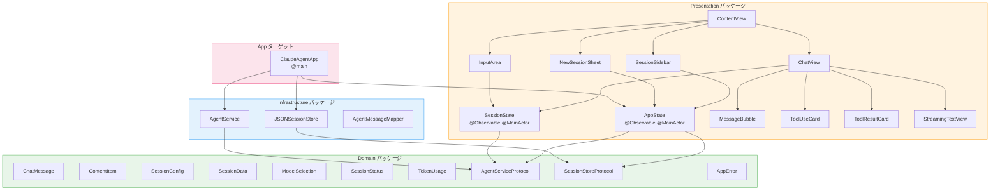
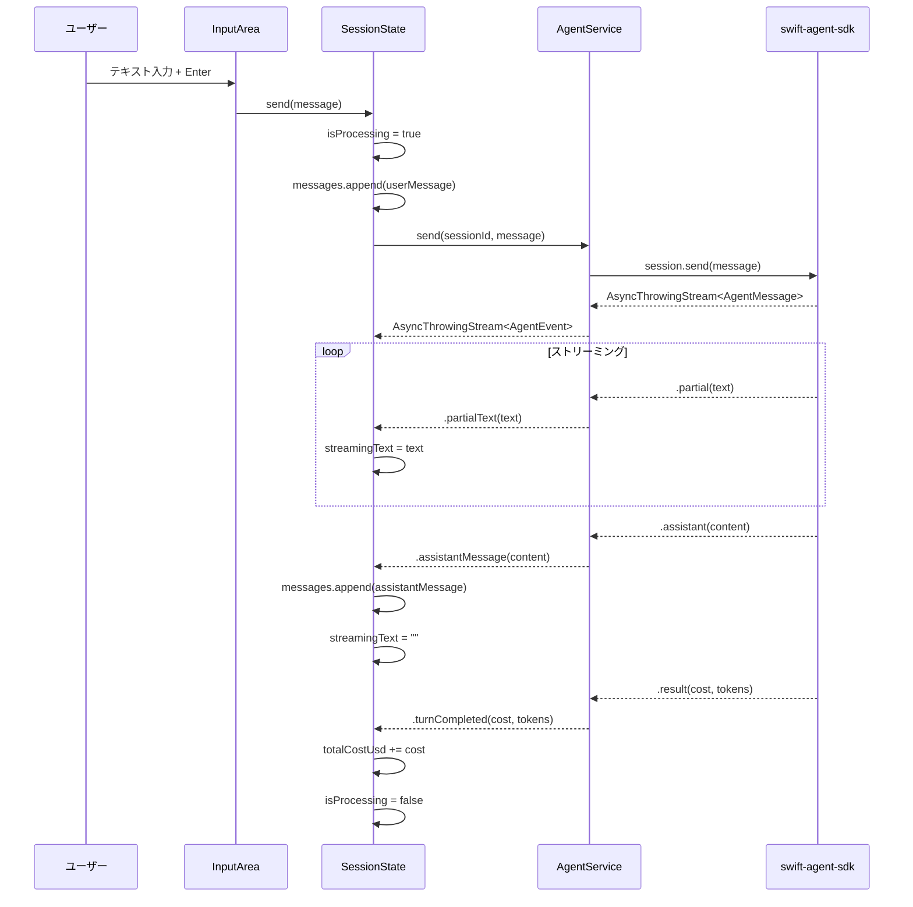

# コンポーネント設計

## 1. パッケージ境界図



## 2. Domain コンポーネント詳細

### 2.1 プロトコル

#### AgentServiceProtocol

```swift
/// SDK セッション管理を抽象化するプロトコル
protocol AgentServiceProtocol: Sendable {
    /// 新規セッションを作成し、メッセージストリームを返す
    func createSession(
        config: SessionConfig
    ) async throws -> (sessionId: String, stream: AsyncThrowingStream<AgentEvent, Error>)

    /// 既存セッションを再開し、メッセージストリームを返す
    func resumeSession(
        id: String,
        config: SessionConfig
    ) async throws -> AsyncThrowingStream<AgentEvent, Error>

    /// メッセージを送信し、応答ストリームを返す
    func send(
        sessionId: String,
        message: String
    ) async throws -> AsyncThrowingStream<AgentEvent, Error>

    /// ストリーミング処理を中断する
    func interrupt(sessionId: String) async throws

    /// セッションを閉じる
    func close(sessionId: String) async throws

    /// モデルを変更する
    func setModel(sessionId: String, model: ModelSelection) async throws
}
```

> **注意**: `AgentEvent` は Domain に定義する enum で、SDK の `AgentMessage` に対応する。
> SDK の型を直接公開せず、Domain レベルで必要な情報のみを抽出した型を使う。

#### SessionStoreProtocol

```swift
/// セッションの永続化を抽象化するプロトコル
protocol SessionStoreProtocol: Sendable {
    func loadAll() throws -> [SessionData]
    func save(_ sessions: [SessionData]) throws
    func delete(sessionId: String) throws
}
```

### 2.2 AgentEvent（SDK メッセージの Domain 表現）

```swift
/// SDK の AgentMessage を Domain レベルに変換した型
enum AgentEvent: Sendable {
    /// セッション初期化完了
    case initialized(sessionId: String)

    /// ストリーミングテキスト（部分応答）
    case partialText(String)

    /// 完成したアシスタント応答
    case assistantMessage(content: [ContentItem])

    /// ターン完了（コスト・トークン情報）
    case turnCompleted(costUsd: Double, inputTokens: Int, outputTokens: Int)
}
```

### 2.3 AppError

```swift
/// アプリケーションレベルのエラー
enum AppError: Error, Sendable, LocalizedError {
    case cliNotFound
    case notConnected
    case sessionExpired
    case connectionTimeout
    case processExited(code: Int)
    case protocolError(String)
    case persistenceError(String)

    var errorDescription: String? {
        switch self {
        case .cliNotFound:
            "Claude Code CLI が見つかりません。npm install -g @anthropic-ai/claude-code を実行してください"
        case .notConnected:
            "セッションが接続されていません"
        case .sessionExpired:
            "セッションの有効期限が切れました"
        case .connectionTimeout:
            "接続がタイムアウトしました"
        case .processExited(let code):
            "Claude Code が予期せず終了しました (code: \(code))"
        case .protocolError(let detail):
            "通信エラーが発生しました: \(detail)"
        case .persistenceError(let detail):
            "データ保存エラー: \(detail)"
        }
    }
}
```

## 3. Infrastructure コンポーネント詳細

### 3.1 AgentService

```swift
/// AgentServiceProtocol の SDK 実装
struct AgentService: AgentServiceProtocol {
    private let mapper = AgentMessageMapper()

    func createSession(
        config: SessionConfig
    ) async throws -> (sessionId: String, stream: AsyncThrowingStream<AgentEvent, Error>) {
        let options = SessionOptions(
            model: config.model.sdkValue,
            systemPrompt: config.systemPrompt,
            permissionMode: .bypassPermissions,
            cwd: config.workingDirectory
        )
        let session = try await AgentSDK.createSession(options: options)
        let stream = session.messages.map { mapper.toEvent($0) }
        return (session.id, stream)
    }
    // ... 他のメソッドも同様に SDK 呼び出し + Mapper 変換
}
```

### 3.2 JSONSessionStore

```swift
/// SessionStoreProtocol の JSON ファイル実装
struct JSONSessionStore: SessionStoreProtocol {
    private let baseURL: URL  // ~/Library/Application Support/ClaudeAgent/

    func loadAll() throws -> [SessionData] {
        let fileURL = baseURL.appendingPathComponent("sessions.json")
        guard FileManager.default.fileExists(atPath: fileURL.path) else { return [] }
        let data = try Data(contentsOf: fileURL)
        let decoder = JSONDecoder()
        decoder.dateDecodingStrategy = .iso8601
        return try decoder.decode([SessionData].self, from: data)
    }

    func save(_ sessions: [SessionData]) throws {
        let encoder = JSONEncoder()
        encoder.dateEncodingStrategy = .iso8601
        encoder.outputFormatting = .prettyPrinted
        let data = try encoder.encode(sessions)
        try data.write(to: baseURL.appendingPathComponent("sessions.json"), options: .atomic)
    }

    func delete(sessionId: String) throws {
        var sessions = try loadAll()
        sessions.removeAll { $0.id == sessionId }
        try save(sessions)
    }
}
```

### 3.3 AgentMessageMapper

SDK の `AgentMessage` を Domain の `AgentEvent` に変換する。
SDK の型が Infrastructure 外に漏洩しないよう、ここで完全に変換する。

## 4. Presentation コンポーネント詳細

### 4.1 AppState

```swift
/// アプリ全体の状態管理
@MainActor @Observable
final class AppState {
    // State
    private(set) var sessions: [SessionState] = []
    var activeSessionId: String?

    // Computed
    var activeSession: SessionState? {
        sessions.first { $0.id == activeSessionId }
    }

    var sortedSessions: [SessionState] {
        sessions.sorted { $0.lastActiveAt > $1.lastActiveAt }
    }

    // Dependencies (Domain protocols)
    private let agentService: any AgentServiceProtocol
    private let sessionStore: any SessionStoreProtocol

    init(agentService: any AgentServiceProtocol, sessionStore: any SessionStoreProtocol) {
        self.agentService = agentService
        self.sessionStore = sessionStore
    }

    // Actions
    func createSession(config: SessionConfig) async throws { ... }
    func deleteSession(id: String) { ... }
    func loadSavedSessions() { ... }
    func saveAllSessions() { ... }
}
```

### 4.2 SessionState

```swift
/// 個別セッションの状態管理
@MainActor @Observable
final class SessionState: Identifiable {
    // Identity
    let id: String
    let config: SessionConfig
    let createdAt: Date

    // State
    private(set) var messages: [ChatMessage] = []
    private(set) var status: SessionStatus = .disconnected
    private(set) var streamingText: String = ""
    private(set) var isProcessing: Bool = false
    private(set) var totalCostUsd: Double = 0
    private(set) var lastTokenUsage: TokenUsage?
    var lastActiveAt: Date

    // Dependencies
    private let agentService: any AgentServiceProtocol
    private var streamTask: Task<Void, Never>?

    // Display
    var displayName: String {
        config.name ?? messages.first(where: { $0.role == .user })?.textPreview ?? "新規セッション"
    }

    // Actions
    func send(_ message: String) async { ... }
    func interrupt() async { ... }
    func reconnect() async throws { ... }
    func disconnect() async { ... }
    func setModel(_ model: ModelSelection) async throws { ... }
}
```

### 4.3 View ← → Store 対応表

| View | 依存する Store | 関連 FR |
|------|--------------|---------|
| ContentView | AppState | — |
| SessionSidebar | AppState | FR-002, FR-003 |
| SessionRow | SessionState (読み取り) | FR-002 |
| ChatView | SessionState | FR-009, FR-010 |
| MessageBubble | — (ChatMessage 渡し) | FR-010, FR-013, FR-014 |
| ToolUseCard | — (ToolUseItem 渡し) | FR-013 |
| ToolResultCard | — (ToolResultItem 渡し) | FR-014 |
| StreamingTextView | SessionState.streamingText | FR-009 |
| InputArea | SessionState | FR-008, FR-011 |
| NewSessionSheet | AppState | FR-001 |
| StatusBadge | SessionState.status | FR-002 |

### 4.4 no-problem パッケージ活用マップ

| パッケージ | 使用する View | 主要 API |
|-----------|-------------|---------|
| swift-markdown-view | MessageBubble | `MarkdownView(source:)` |
| swift-design-system | ContentView (テーマ), ToolUseCard, ToolResultCard | `ThemeProvider`, `Card` |
| swift-ui-routing | ContentView (SplitView), NewSessionSheet | `SplitViewPresenter`, `SheetPresenter`, `AlertPresenter` |

## 5. メッセージストリーム処理フロー



## 更新履歴

| 日付 | 変更内容 |
|------|---------|
| 2026-02-08 | 初版作成 |
