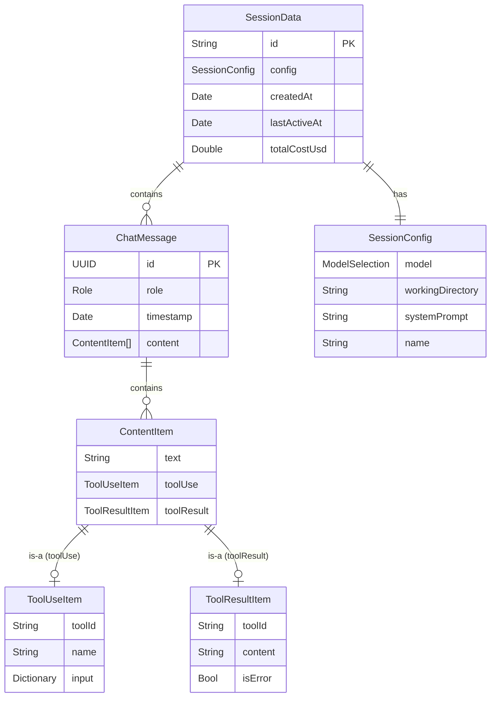

# データモデル

## 1. ER 図



## 2. Domain エンティティ（Swift 型定義）

### 2.1 ChatMessage

```swift
/// チャットメッセージ（表示用 + 永続化用）
struct ChatMessage: Identifiable, Codable, Sendable {
    let id: UUID
    let role: Role
    let timestamp: Date
    var content: [ContentItem]

    enum Role: String, Codable, Sendable {
        case user
        case assistant
        case system
    }

    /// サイドバー表示用のテキストプレビュー（先頭 30 文字）
    var textPreview: String? {
        content.compactMap {
            if case .text(let text) = $0 { return text }
            return nil
        }.first.map { String($0.prefix(30)) }
    }

    init(role: Role, content: [ContentItem]) {
        self.id = UUID()
        self.role = role
        self.timestamp = Date()
        self.content = content
    }
}
```

### 2.2 ContentItem

```swift
/// メッセージ内のコンテンツブロック
enum ContentItem: Codable, Sendable, Hashable {
    case text(String)
    case toolUse(ToolUseItem)
    case toolResult(ToolResultItem)
}
```

### 2.3 ToolUseItem

```swift
/// ツール使用情報
struct ToolUseItem: Codable, Sendable, Hashable, Identifiable {
    let id: String         // toolUseId（SDK 発行）
    let name: String       // ツール名（"Bash", "Read", "Write" 等）
    let input: [String: String]  // パラメータ（表示用に文字列化）
}
```

### 2.4 ToolResultItem

```swift
/// ツール実行結果
struct ToolResultItem: Codable, Sendable, Hashable {
    let toolUseId: String  // 対応する ToolUseItem の id
    let content: String    // 結果テキスト
    let isError: Bool      // エラー結果かどうか
}
```

### 2.5 SessionConfig

```swift
/// セッション作成時の設定
struct SessionConfig: Codable, Sendable {
    var model: ModelSelection
    var workingDirectory: String
    var systemPrompt: String?
    var name: String?

    init(
        model: ModelSelection = .sonnet,
        workingDirectory: String,
        systemPrompt: String? = nil,
        name: String? = nil
    ) {
        self.model = model
        self.workingDirectory = workingDirectory
        self.systemPrompt = systemPrompt
        self.name = name
    }
}
```

### 2.6 SessionData

```swift
/// セッションの永続化データ
struct SessionData: Codable, Sendable, Identifiable {
    let id: String               // SDK セッション ID
    let config: SessionConfig
    let createdAt: Date
    var lastActiveAt: Date
    var messages: [ChatMessage]
    var totalCostUsd: Double
}
```

### 2.7 TokenUsage

```swift
/// トークン使用量（直近ターン）
struct TokenUsage: Sendable {
    let inputTokens: Int
    let outputTokens: Int
}
```

## 3. 値オブジェクト

### 3.1 ModelSelection

```swift
/// 利用可能なモデル
enum ModelSelection: String, Codable, Sendable, CaseIterable {
    case opus
    case sonnet
    case haiku

    /// 表示名
    var displayName: String {
        switch self {
        case .opus: "Opus"
        case .sonnet: "Sonnet"
        case .haiku: "Haiku"
        }
    }
}
```

### 3.2 SessionStatus

```swift
/// セッションの接続状態
enum SessionStatus: String, Sendable {
    case connecting       // SDK 接続中（ローディング表示）
    case connected        // 接続済み（メッセージ送信可能）
    case disconnected     // 切断済み（再接続可能）
    case error            // エラー（再接続ボタン表示）
}
```

> SessionStatus は Codable にしない。復元時は常に `.disconnected` から開始するため。

## 4. 永続化仕様

### 4.1 保存ファイル

```
~/Library/Application Support/ClaudeAgent/
└── sessions.json
```

### 4.2 JSON 構造例

```json
[
  {
    "id": "session-abc-123",
    "config": {
      "model": "sonnet",
      "workingDirectory": "/Users/dev/project",
      "systemPrompt": null,
      "name": "プロジェクト相談"
    },
    "createdAt": "2026-02-08T10:00:00Z",
    "lastActiveAt": "2026-02-08T10:15:00Z",
    "totalCostUsd": 0.0456,
    "messages": [
      {
        "id": "550E8400-E29B-41D4-A716-446655440000",
        "role": "user",
        "timestamp": "2026-02-08T10:00:30Z",
        "content": [
          { "text": "このプロジェクトの構成を教えて" }
        ]
      },
      {
        "id": "550E8400-E29B-41D4-A716-446655440001",
        "role": "assistant",
        "timestamp": "2026-02-08T10:00:45Z",
        "content": [
          { "text": "プロジェクトの構成は以下の通りです..." },
          { "toolUse": { "id": "tool-1", "name": "Glob", "input": { "pattern": "**/*.swift" } } },
          { "toolResult": { "toolUseId": "tool-1", "content": "Sources/...", "isError": false } }
        ]
      }
    ]
  }
]
```

### 4.3 保存タイミング

| トリガー | 保存内容 | 対応 FR |
|---------|---------|---------|
| セッション作成 | SessionData（messages 空） | FR-021 |
| `.result` 受信 | messages + totalCostUsd 更新 | FR-022 |
| セッション終了 | lastActiveAt 更新 | FR-005 |
| セッション削除 | 該当データ削除 | FR-024 |
| アプリ終了 | 全 SessionData | FR-022 |

### 4.4 型 ↔ パッケージ対応表

| 型 | パッケージ | 用途 |
|----|----------|------|
| ChatMessage | Domain | 表示 + 永続化 |
| ContentItem | Domain | メッセージ内コンテンツ |
| ToolUseItem | Domain | ツール使用表示 |
| ToolResultItem | Domain | ツール結果表示 |
| SessionConfig | Domain | セッション設定 |
| SessionData | Domain | 永続化データ |
| ModelSelection | Domain | モデル列挙 |
| SessionStatus | Domain | 接続状態（永続化しない） |
| TokenUsage | Domain | トークン情報（永続化しない） |
| AgentEvent | Domain | SDK イベントの抽象型 |
| AppError | Domain | エラー型 |

## 更新履歴

| 日付 | 変更内容 |
|------|---------|
| 2026-02-08 | 初版作成 |
