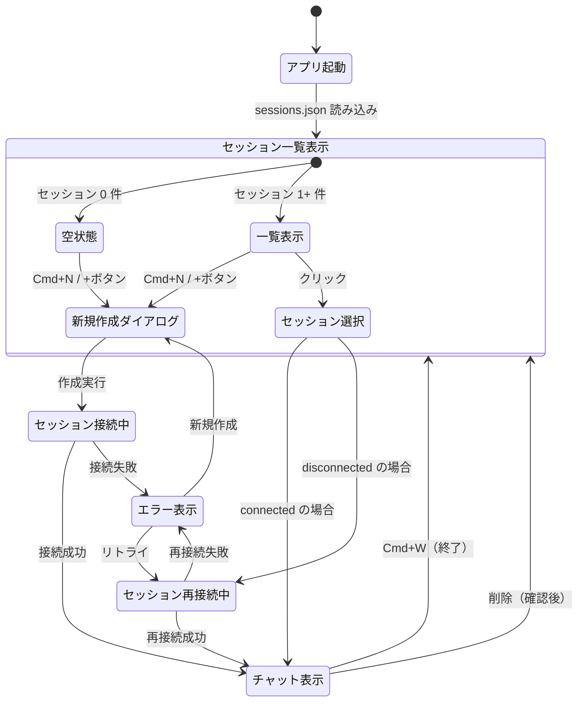
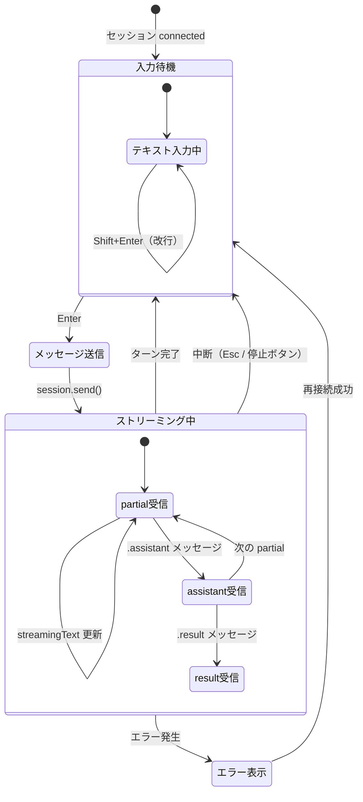
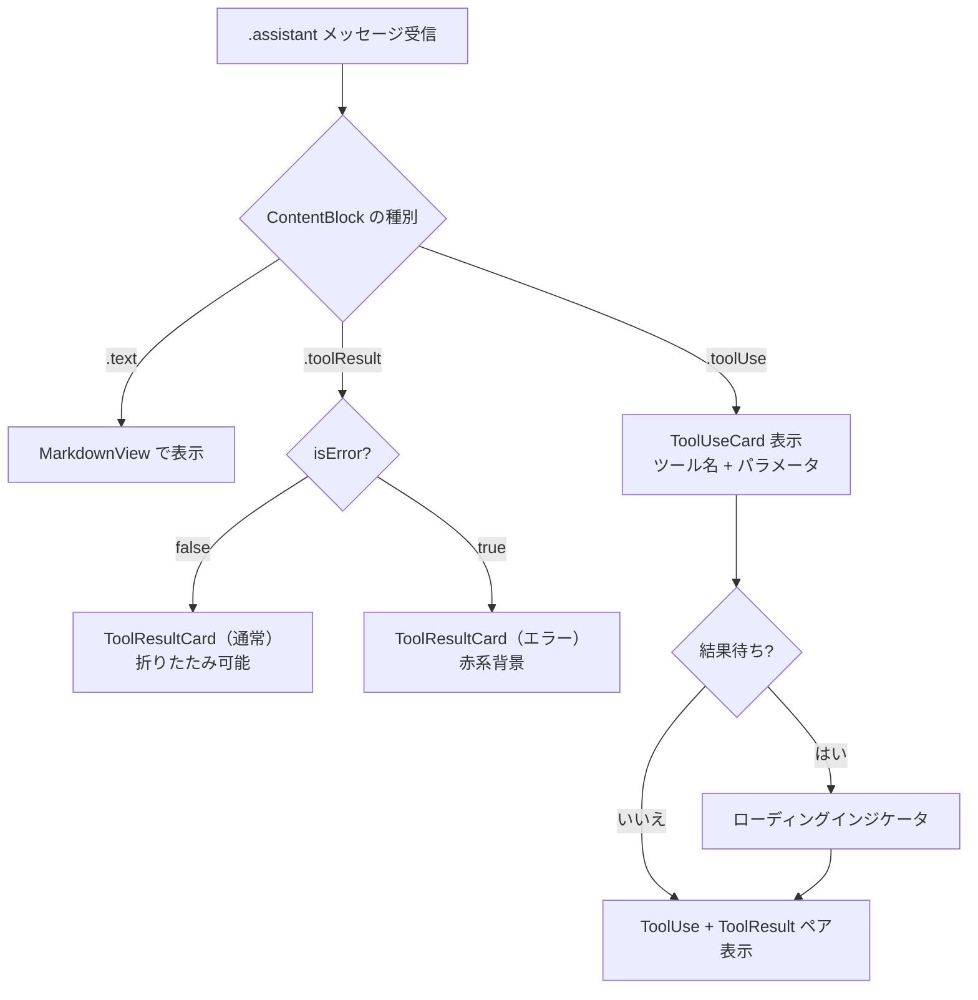
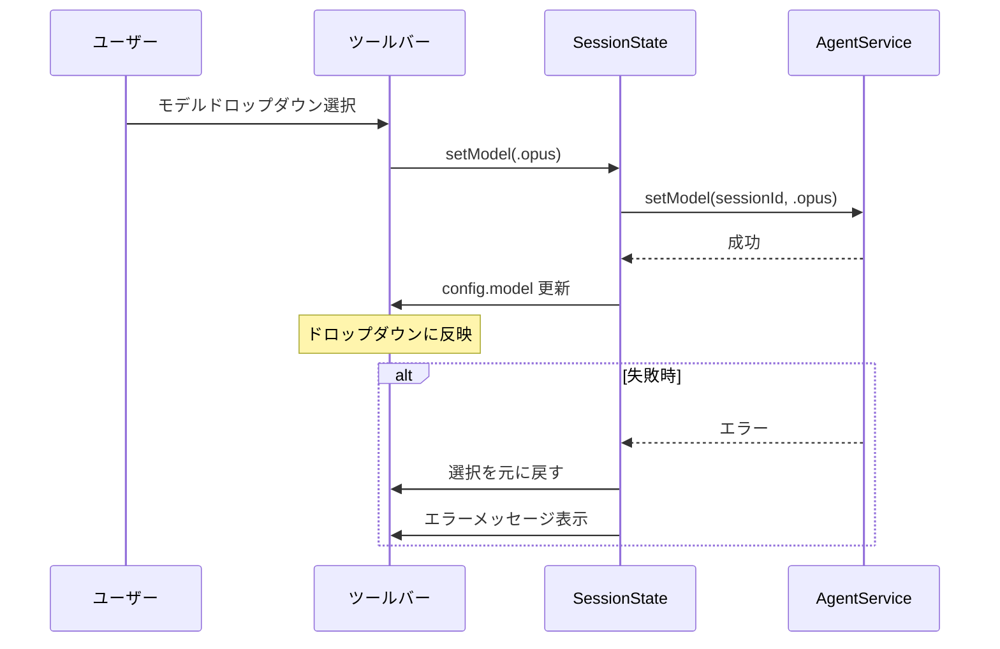
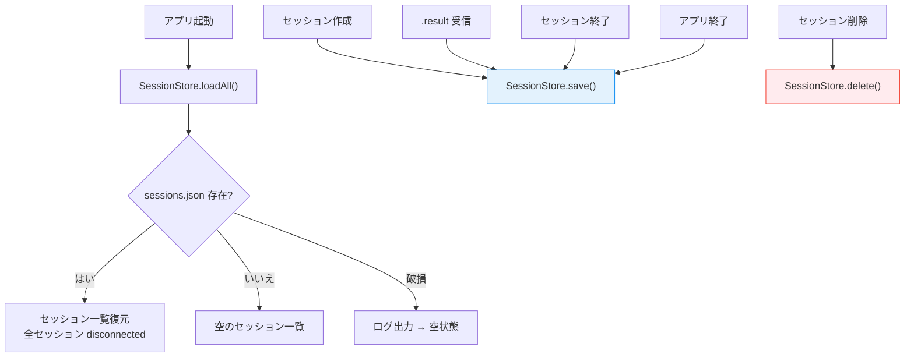

# 画面フロー

## 1. 画面構成（全体レイアウト）

```
┌─────────────────────────────────────────────────────────────┐
│  [+ 新規] [モデル: ▼ Sonnet] [/Users/dev/project]  [$0.04] │ ← ツールバー
├────────────────┬────────────────────────────────────────────┤
│                │                                            │
│  セッション    │  チャットエリア                              │
│  サイドバー    │                                            │
│                │  ┌── MessageBubble (user) ──────────┐     │
│  ● Session 1   │  │ メッセージテキスト                 │     │
│  ○ Session 2   │  └─────────────────────────────────┘     │
│  ○ Session 3   │                                            │
│                │  ┌── MessageBubble (assistant) ────┐     │
│                │  │ Markdown レンダリングテキスト      │     │
│                │  │ ┌── ToolUseCard ────────────┐   │     │
│                │  │ │ 🔧 Read { path: "..." }   │   │     │
│                │  │ └──────────────────────────┘   │     │
│                │  │ ┌── ToolResultCard ─────────┐   │     │
│                │  │ │ ▼ 結果テキスト（折りたたみ）│   │     │
│                │  │ └──────────────────────────┘   │     │
│                │  └─────────────────────────────────┘     │
│                │                                            │
│                │  ┌── StreamingText ────────────────┐     │
│                │  │ ストリーミング中テキスト...▌       │     │
│                │  └─────────────────────────────────┘     │
│                │                                            │
│                ├────────────────────────────────────────────┤
│                │  ┌── InputArea ────────────────────┐     │
│                │  │ メッセージを入力...     [■ 停止] │     │
│                │  └─────────────────────────────────┘     │
└────────────────┴────────────────────────────────────────────┘
```

## 2. FF-001: セッション管理フロー



## 3. FF-002: チャットメッセージングフロー



## 4. FF-003: ツール可視化フロー



## 5. FF-004: モデル・設定制御フロー



## 6. FF-005: データ永続化フロー



## 7. 画面遷移サマリー

| 起点 | アクション | 遷移先 | 対応 FR |
|------|----------|--------|---------|
| 空状態 | Cmd+N / +ボタン | NewSessionSheet | FR-001 |
| サイドバー | セッションクリック | ChatView (切替) | FR-003 |
| サイドバー | コンテキストメニュー → 終了 | ステータス変更 | FR-005 |
| サイドバー | コンテキストメニュー → 削除 | 確認ダイアログ → 削除 | FR-006 |
| サイドバー | ダブルクリック | 名前変更モード | FR-007 |
| ChatView | Enter | メッセージ送信 → ストリーミング | FR-008, FR-009 |
| ChatView | Esc / 停止ボタン | 処理中断 | FR-011 |
| ツールバー | モデルドロップダウン | モデル変更 | FR-016 |
| エラーバナー | 再接続ボタン | セッション再接続 | FR-004 |

## 8. キーボードショートカット一覧

| ショートカット | アクション | 対応画面 |
|---------------|----------|---------|
| Cmd+N | 新規セッション作成 | グローバル |
| Enter | メッセージ送信 | InputArea |
| Shift+Enter | 改行 | InputArea |
| Esc | 処理中断 | ChatView（ストリーミング中） |
| Cmd+W | セッション終了 | ChatView |

## 更新履歴

| 日付 | 変更内容 |
|------|---------|
| 2026-02-08 | 初版作成 |
