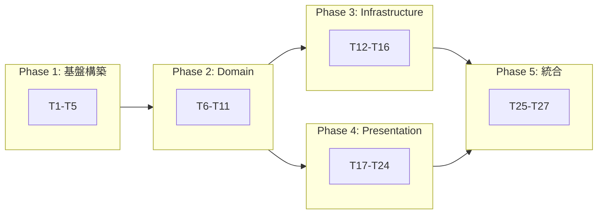
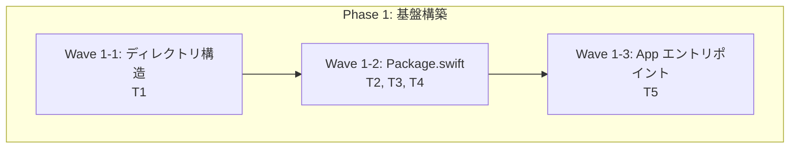
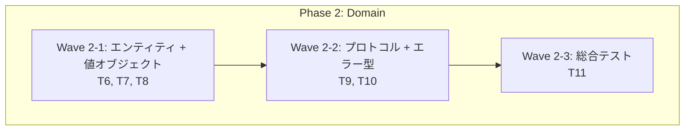
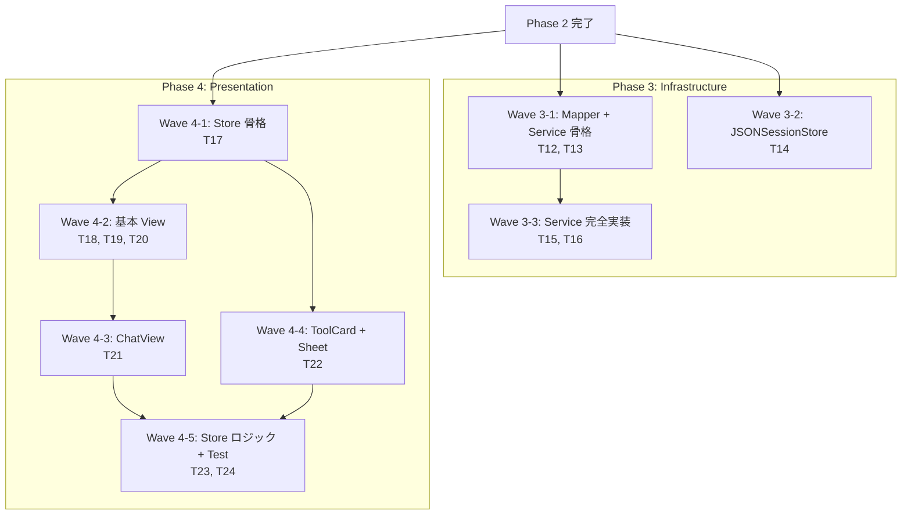
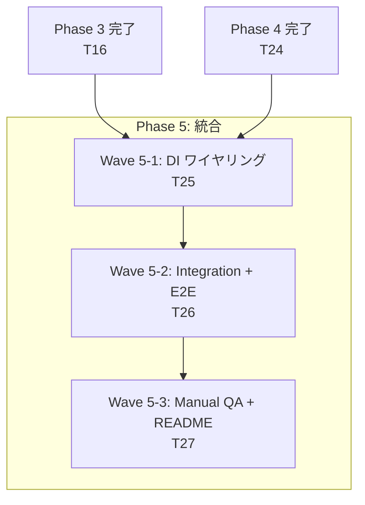
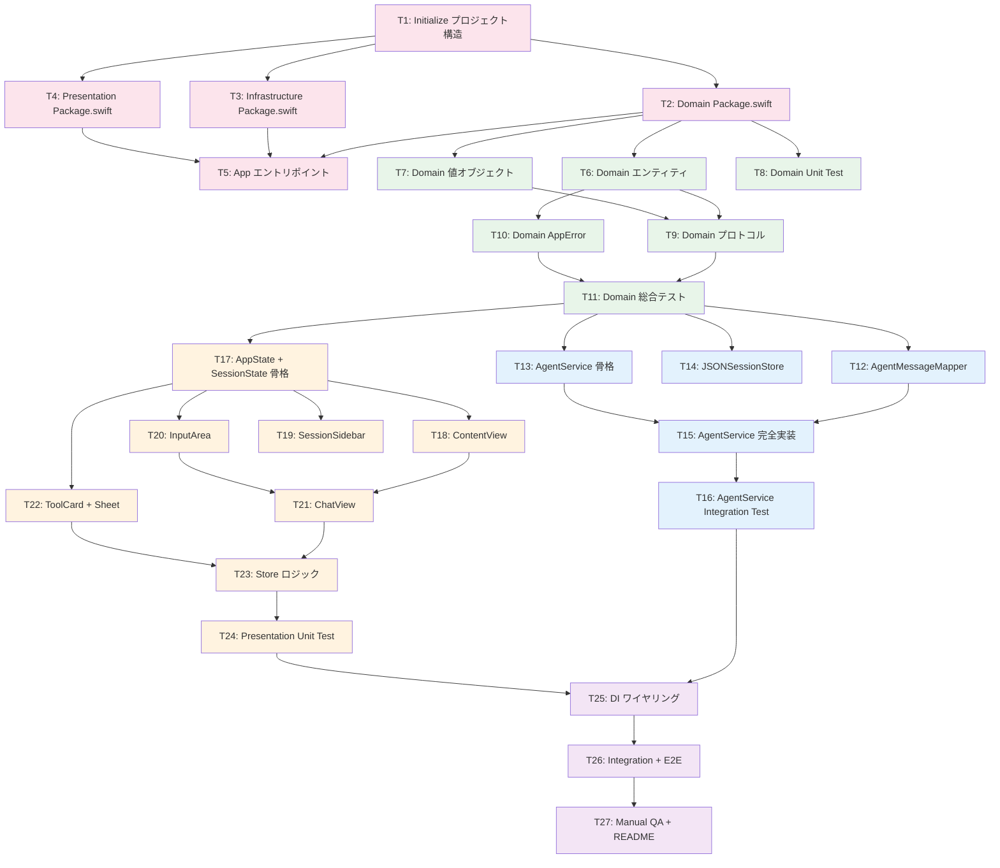

# 依存関係 Mermaid 図

## 1. Phase 間依存関係図

## 2. Wave 間依存関係図

### Phase 1

### Phase 2

### Phase 3 + Phase 4（並列）

### Phase 5

## 3. Task 間依存関係図（全体）

### 凡例

| 色 | Phase |
|----|-------|
| 赤系 | Phase 1: 基盤構築 |
| 緑系 | Phase 2: Domain |
| 青系 | Phase 3: Infrastructure |
| 橙系 | Phase 4: Presentation |
| 紫系 | Phase 5: 統合 |

## 更新履歴

| 日付 | 変更内容 |
|------|---------|
| 2026-02-08 | 初版作成 |
