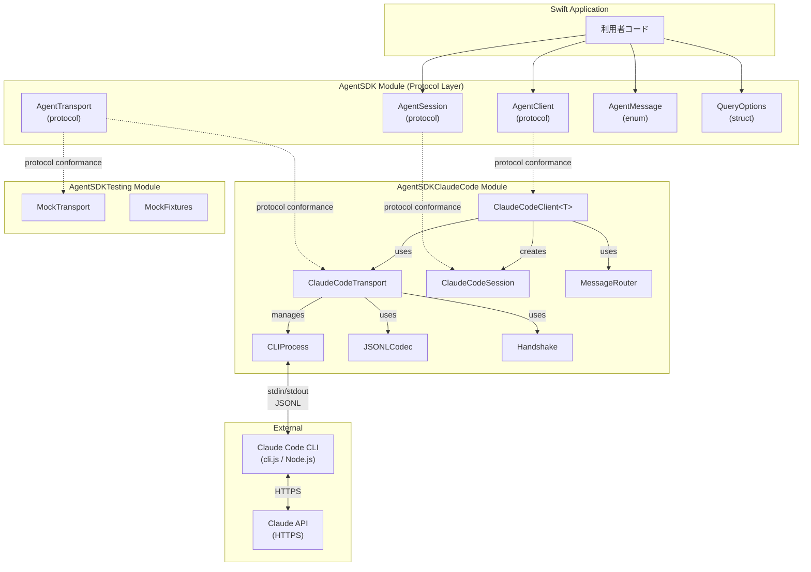
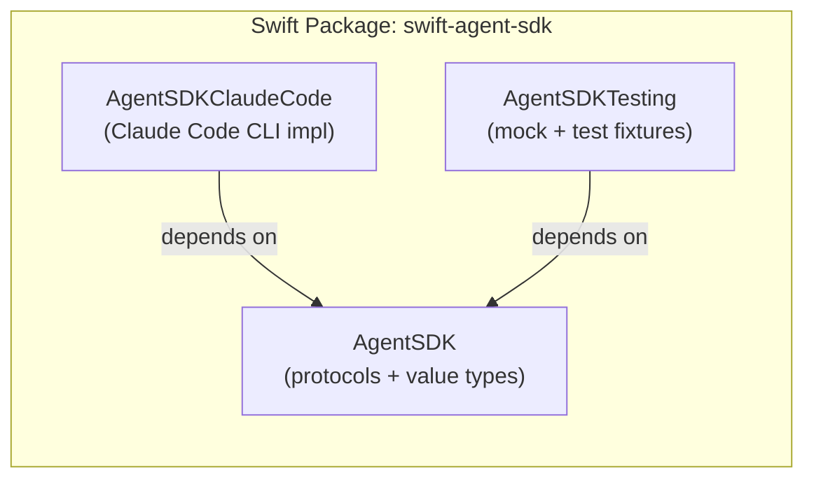
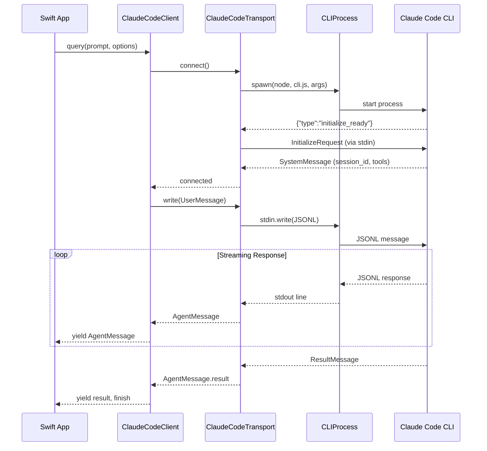
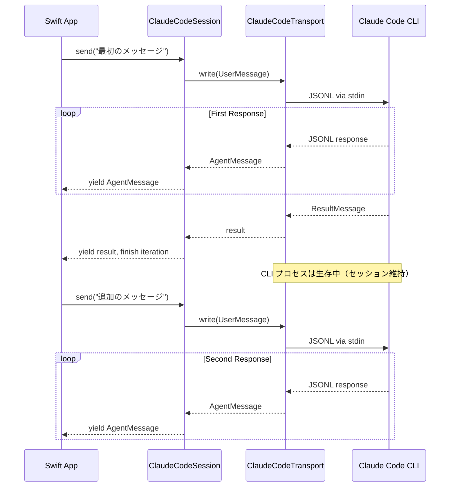

# アーキテクチャ概要

## Intent（意図）

Swift Agent SDK のシステム全体像を定義する。
Protocol 層と Concrete 層の分離、モジュール構成、データフローを明確にし、
実装者が全体構造を把握した上で各コンポーネントの開発に着手できるようにする。

---

## 1. システム構成図

### 1.1 全体像

### 1.2 モジュール構成

| モジュール | 役割 | 依存先 | 公開対象 |
|-----------|------|--------|---------|
| `AgentSDK` | Protocol 定義・共通値型 | なし（Foundation のみ） | 全利用者 |
| `AgentSDKClaudeCode` | Claude Code CLI 具象実装 | `AgentSDK` | CLI 利用者 |
| `AgentSDKTesting` | MockTransport・テストフィクスチャ | `AgentSDK` | テストターゲットのみ |

---

## 2. データフロー

### 2.1 ワンショットクエリのデータフロー

### 2.2 セッション維持のデータフロー

---

## 3. 設計方針

### 3.1 基本原則

| 原則 | 適用 |
|------|------|
| **Protocol-Oriented** | 公開 API はすべて Swift protocol で定義。利用者は具象型に依存しない |
| **Dependency Injection** | Transport はコンストラクタ注入。テスト・差し替えが容易 |
| **Generics over Existential** | `some AgentClient` / `<T: AgentTransport>` で型消去コストを回避 |
| **Value Semantics** | メッセージ・オプション・エラーはすべて値型（struct / enum） |
| **Zero External Dependencies** | Foundation のみ。サードパーティ依存なし |
| **Concurrency-Safe** | 全 public 型は `Sendable` 準拠。Actor で状態を保護 |

### 3.2 レイヤー間の責務分離

| レイヤー | 責務 | Claude Code 知識 |
|---------|------|-----------------|
| Protocol Layer | API の抽象定義 | なし（バックエンド非依存） |
| Concrete Layer | CLI サブプロセス制御・JSONL プロトコル | あり（CLI 固有） |
| Testing Layer | テスト支援 | なし（Protocol に対してモック） |

---

## Rationale（根拠）

### 3モジュール分割の採用（D-14）

**決定:** `AgentSDK` + `AgentSDKClaudeCode` + `AgentSDKTesting` の 3 モジュール構成

**採用理由:**
- Protocol 層のみを import してモック実装が可能
- CLI 具象が不要なテストで Node.js 依存が入らない
- 将来の別バックエンド（Direct API 等）追加時に `AgentSDK` を再利用可能

**検討した代替案:**

| 代替案 | 不採用理由 |
|--------|-----------|
| 単一モジュール | Protocol 層と具象層が不分離。テスト時に不要な CLI 依存が入る |
| 2モジュール（AgentSDK + AgentSDKClaudeCode） | テスト支援が本番モジュールに混入するか、利用者が自前でモック実装する必要がある |
| 4モジュール以上 | 過剰な分割。実用上の利点が薄い |

### Generics 採用（D-8）

**決定:** Existential（`any AgentClient`）ではなく Generics（`some AgentClient` / `<T: AgentClient>`）を採用

**採用理由:**
- 型消去コスト（existential container のヒープ確保）を回避
- Swift 6 での `any` キーワード要求と整合
- コンパイラによる最適化（specialization）が効く

---

## 変更履歴

| 日付 | 変更内容 | 変更者 |
|------|---------|--------|
| 2026-02-08 | 初版作成 | Claude Code |
