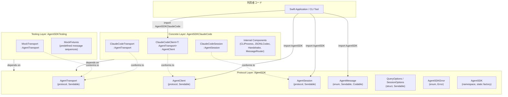
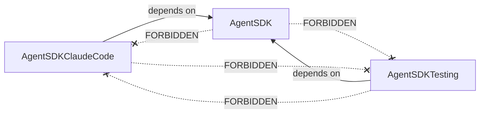
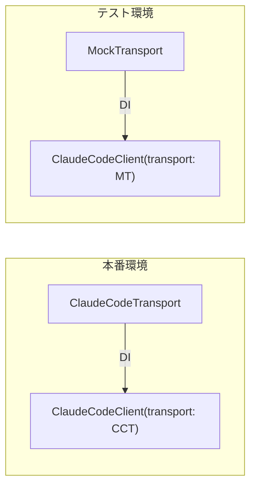

# レイヤーアーキテクチャ

## Intent（意図）

3 モジュール（AgentSDK / AgentSDKClaudeCode / AgentSDKTesting）のレイヤー構成と、
各レイヤー間の依存関係ルールを定義する。
Protocol 層の安定性を保証し、具象層の変更が利用者コードに波及しない設計を実現する。

---

## 1. レイヤー構成図



---

## 2. 依存関係ルール

### 2.1 許可される依存

| From | To | 許可 | 備考 |
|------|-----|------|------|
| 利用者コード | AgentSDK | Yes | Protocol に対してプログラミング |
| 利用者コード | AgentSDKClaudeCode | Yes | 具象型の初期化のみ |
| 利用者コード | AgentSDKTesting | Yes | テストターゲットのみ |
| AgentSDKClaudeCode | AgentSDK | Yes | Protocol への準拠 |
| AgentSDKTesting | AgentSDK | Yes | Protocol への準拠 |

### 2.2 禁止される依存

| From | To | 禁止理由 |
|------|-----|---------|
| AgentSDK | AgentSDKClaudeCode | Protocol 層が具象に依存してはならない |
| AgentSDK | AgentSDKTesting | Protocol 層がテスト支援に依存してはならない |
| AgentSDKTesting | AgentSDKClaudeCode | テスト層が特定の具象に依存してはならない |
| AgentSDKClaudeCode | AgentSDKTesting | 本番コードがテスト支援に依存してはならない |

### 2.3 依存方向図



---

## 3. Protocol Layer 詳細（AgentSDK モジュール）

### 3.1 AgentTransport

```swift
/// 通信層の抽象。バックエンドとの接続・メッセージ送受信を担う。
/// Claude Code 固有の概念（JSONL, CLI 等）を含まない。
public protocol AgentTransport: Sendable {
    /// 接続を確立する（CLI 起動 + ハンドシェイク相当）
    func connect() async throws

    /// メッセージを送信する
    func write(_ data: Data) async throws

    /// 受信メッセージのストリームを返す
    func messages() -> AsyncThrowingStream<Data, Error>

    /// 接続を切断する（プロセス終了相当）
    func close() async throws

    /// 接続状態
    var isReady: Bool { get async }
}
```

**設計根拠:**
- メソッド引数・戻り値は `Data` 型。具象層がエンコード/デコードの責務を持つ
- `messages()` は `AsyncThrowingStream` を返す。利用者は `for try await` で消費
- `isReady` は `async` プロパティ。Actor 内部状態へのアクセスを許容

### 3.2 AgentClient

```swift
/// 操作層の抽象。クエリ・セッション管理を担う。
public protocol AgentClient: Sendable {
    associatedtype SessionType: AgentSession

    /// ワンショットクエリ
    func query(
        prompt: String,
        options: QueryOptions
    ) -> AsyncThrowingStream<AgentMessage, Error>

    /// セッション作成
    func createSession(
        options: SessionOptions
    ) async throws -> SessionType

    /// セッション再開
    func resumeSession(
        id: String,
        options: SessionOptions
    ) async throws -> SessionType
}
```

**設計根拠:**
- `associatedtype SessionType` で具象セッション型をジェネリクスで伝播（D-8）
- `query()` は `AsyncThrowingStream` を直接返す（`async` メソッドではなく同期的にストリームを返し、内部で非同期起動）

### 3.3 AgentSession

```swift
/// セッション層の抽象。セッション内の対話を担う。
public protocol AgentSession: Sendable {
    /// セッション識別子
    var id: String { get async }

    /// メッセージ送信・応答ストリーム受信
    func send(_ message: String) -> AsyncThrowingStream<AgentMessage, Error>

    /// 処理中断
    func interrupt() async throws

    /// セッション終了
    func close() async throws
}
```

**設計根拠:**
- `id` は `async` プロパティ。初期化完了まで待機が必要な場合がある
- `send()` はストリームを返す。セッション内の各メッセージも非同期ストリーミング

### 3.4 コンビニエンス API

```swift
/// デフォルトの Claude Code 実装を使うファクトリ。
/// DI を意識しない利用者向け。
public enum AgentSDK {
    /// ワンショットクエリ（デフォルト ClaudeCode 実装）
    public static func query(
        prompt: String,
        options: QueryOptions = .init()
    ) -> AsyncThrowingStream<AgentMessage, Error>

    /// セッション作成（デフォルト ClaudeCode 実装）
    public static func createSession(
        options: SessionOptions = .init()
    ) async throws -> some AgentSession
}
```

**設計根拠:**
- `enum AgentSDK` は namespace として使用（インスタンス化不可）
- 内部で `ClaudeCodeTransport` + `ClaudeCodeClient` を生成
- 戻り値は `some AgentSession` で具象型を隠蔽

---

## 4. DI 設計

### 4.1 コンストラクタ注入パターン



### 4.2 DI ポイント

| 注入先 | 注入される型 | 注入方法 |
|--------|------------|---------|
| `ClaudeCodeClient` | `AgentTransport` 準拠型 | コンストラクタ引数（generics `T`） |

```swift
// 具象 Client の定義
public struct ClaudeCodeClient<T: AgentTransport>: AgentClient {
    private let transport: T

    public init(transport: T) {
        self.transport = transport
    }
}
```

### 4.3 利用パターン

| パターン | コード | Transport |
|---------|-------|-----------|
| コンビニエンス | `AgentSDK.query(prompt:)` | 内部で ClaudeCodeTransport を自動生成 |
| 明示的 DI | `ClaudeCodeClient(transport: myTransport)` | 利用者が Transport を指定 |
| テスト | `ClaudeCodeClient(transport: MockTransport(...))` | MockTransport を注入 |

---

## 5. 保守性・追従性

### 5.1 CLI プロトコル変更時の影響範囲

| 変更内容 | 影響範囲 | Protocol 層への影響 |
|---------|---------|-------------------|
| JSONL メッセージ型の追加 | `JSONLCodec` + `MessageRouter` | なし |
| 初期化プロトコルの変更 | `Handshake` | なし |
| CLI 引数の変更 | `CLIProcess` | なし |
| 制御メッセージサブタイプ追加 | `MessageRouter` | なし |
| 新しい AgentMessage 種別 | `AgentMessage` enum にケース追加 | あり（共通型に追加） |

### 5.2 安定性保証

- Protocol 層（AgentSDK モジュール）は **Semantic Versioning** に従う
- Protocol のメソッド追加はメジャーバージョンアップ（breaking change）
- 具象層の変更はパッチ/マイナーバージョンで対応

---

## Rationale（根拠）

### Protocol の Claude Code 非依存性

**決定:** AgentTransport / AgentClient / AgentSession に CLI 固有概念を含めない

**採用理由:**
- 将来の別バックエンド（Direct API, 他 LLM）追加を阻害しない
- テスト時に CLI 固有の知識が不要
- Python SDK の Transport ABC と同じ設計哲学

### 単一 Protocol 基本（D-9）

**決定:** 各レイヤーは単一 protocol を基本とし、必要に応じて分割する

**採用理由:**
- Go SDK の ISP 5分割は過剰
- メソッド数が 5 以下で収まるため、分割の必要がない
- ランタイム制御（interrupt, setModel 等）は AgentSession の責務

---

## 変更履歴

| 日付 | 変更内容 | 変更者 |
|------|---------|--------|
| 2026-02-08 | 初版作成 | Claude Code |
