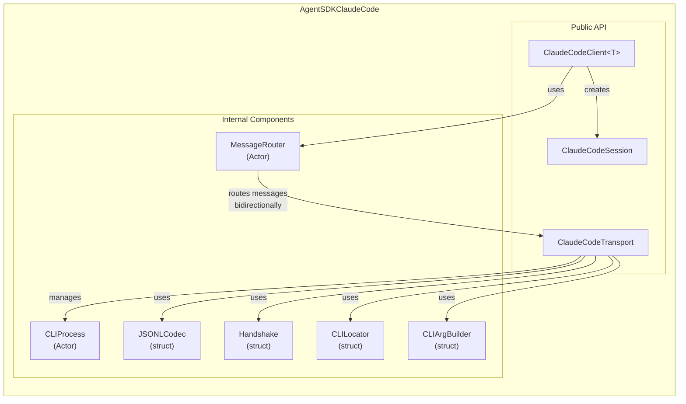
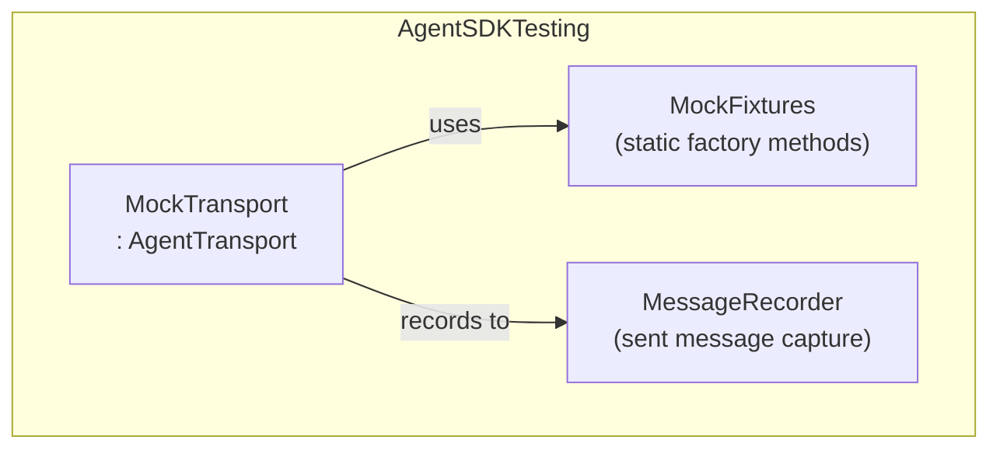
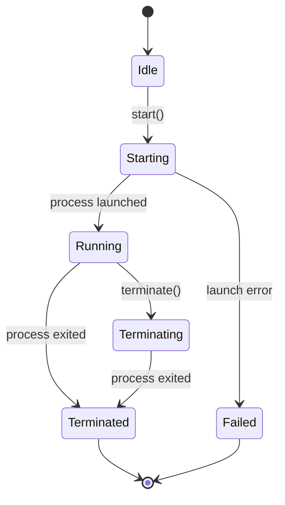

# コンポーネント設計

## Intent（意図）

各モジュール内の内部コンポーネント構成とディレクトリ構造を定義する。
実装者が各コンポーネントの責務と境界を理解し、ファイル配置に迷わないようにする。

---

## 1. コンポーネント構成図

### 1.1 AgentSDKClaudeCode 内部コンポーネント



### 1.2 AgentSDKTesting 内部コンポーネント



---

## 2. コンポーネント詳細

### 2.1 CLIProcess（Actor）

| 属性 | 値 |
|------|-----|
| **責務** | CLI サブプロセスのライフサイクル管理 |
| **可視性** | `internal`（AgentSDKClaudeCode モジュール内） |
| **並行性** | Actor（プロセス状態を排他的に管理） |

**主要メソッド:**

| メソッド | 説明 |
|---------|------|
| `start(executable:runtime:arguments:environment:cwd:)` | プロセスを起動し stdin/stdout パイプを確立 |
| `writeToStdin(_ data: Data)` | stdin にデータを書き込み |
| `stdoutStream() -> AsyncThrowingStream<Data, Error>` | stdout の行ストリームを返す |
| `stderrContent() -> String` | 蓄積された stderr 内容を返す |
| `terminate()` | プロセスを SIGTERM で終了。応答なしなら SIGKILL |
| `waitForExit() -> Int32` | プロセス終了を待機し exit code を返す |

**状態遷移:**



### 2.2 JSONLCodec（struct）

| 属性 | 値 |
|------|-----|
| **責務** | JSONL 行のエンコード/デコード |
| **可視性** | `internal` |
| **並行性** | Sendable（状態なし） |

**主要メソッド:**

| メソッド | 説明 |
|---------|------|
| `encode<T: Encodable>(_ value: T) throws -> Data` | 値を JSON 行（末尾 `\n`）にエンコード |
| `decode<T: Decodable>(_ line: Data) throws -> T` | JSON 行をデコード |
| `decodeMessageType(_ line: Data) throws -> String` | `type` フィールドのみを先読み |

### 2.3 Handshake（struct）

| 属性 | 値 |
|------|-----|
| **責務** | CLI 初期化プロトコルの実行 |
| **可視性** | `internal` |
| **並行性** | Sendable |

**フロー:**
1. `initialize_ready` メッセージを待機（タイムアウト: 60 秒）
2. `InitializeRequest` を送信
3. `SystemMessage` を受信して session_id・ツール一覧を取得

### 2.4 MessageRouter（Actor）

| 属性 | 値 |
|------|-----|
| **責務** | 双方向メッセージルーティング（ストリーム配信 + 制御リクエスト/レスポンス） |
| **可視性** | `internal` |
| **並行性** | Actor（複数のストリームと pending リクエストを管理） |

**主要機能:**

| 機能 | 説明 |
|------|------|
| メッセージ分類 | `type` フィールドで assistant / result / system / control_request / control_response に分類 |
| ストリーム配信 | assistant / result / system メッセージを利用者ストリームに yield |
| 制御リクエスト処理 | CLI からの `can_use_tool` 等をカスタムハンドラにルーティング |
| 制御レスポンス待機 | SDK→CLI の制御リクエストの応答を待機（タイムアウト: 30 秒） |
| request_id 管理 | pending リクエストの ID と continuation を管理 |

### 2.5 CLILocator（struct）

| 属性 | 値 |
|------|-----|
| **責務** | CLI バイナリの探索 |
| **可視性** | `internal` |
| **並行性** | Sendable |

**探索順序（FR-001）:**
1. ユーザー指定パス（options）
2. 環境変数 `CLAUDE_CODE_CLI_PATH`
3. `./node_modules/@anthropic-ai/claude-agent-sdk/cli.js`
4. グローバル npm パッケージ
5. システム PATH 上の `claude` コマンド

### 2.6 CLIArgBuilder（struct）

| 属性 | 値 |
|------|-----|
| **責務** | CLI 起動引数の構成 |
| **可視性** | `internal` |
| **並行性** | Sendable |

**構成する引数（FR-003）:**
- `--output-format stream-json`
- `--input-format stream-json`
- `--verbose`
- `--system-prompt`（指定時）
- `--permission-mode`（指定時）
- `--resume`（セッション再開時）
- `--max-turns`（指定時）

### 2.7 MockTransport

| 属性 | 値 |
|------|-----|
| **責務** | テスト用の AgentTransport 準拠型 |
| **可視性** | `public`（AgentSDKTesting モジュール） |
| **並行性** | Actor |

**主要機能:**

| 機能 | 説明 |
|------|------|
| 事前定義応答 | 初期化時に応答メッセージシーケンスを設定 |
| メッセージ記録 | `write()` で送信されたメッセージを記録 |
| 送信メッセージ検証 | `sentMessages` プロパティでアサート可能 |
| 接続状態シミュレーション | `isReady` の制御 |

---

## 3. ディレクトリ構造

```
swift-agent-sdk/
├── Package.swift
├── Sources/
│   ├── AgentSDK/
│   │   ├── Protocols/
│   │   │   ├── AgentTransport.swift
│   │   │   ├── AgentClient.swift
│   │   │   └── AgentSession.swift
│   │   ├── Models/
│   │   │   ├── AgentMessage.swift
│   │   │   ├── QueryOptions.swift
│   │   │   ├── SessionOptions.swift
│   │   │   ├── AgentDefinition.swift
│   │   │   ├── PermissionMode.swift
│   │   │   ├── PermissionDecision.swift
│   │   │   ├── MCPServerConfig.swift
│   │   │   └── ContentBlock.swift
│   │   ├── Errors/
│   │   │   └── AgentSDKError.swift
│   │   └── AgentSDK.swift            # namespace + convenience API
│   │
│   ├── AgentSDKClaudeCode/
│   │   ├── ClaudeCodeTransport.swift
│   │   ├── ClaudeCodeClient.swift
│   │   ├── ClaudeCodeSession.swift
│   │   └── Internal/
│   │       ├── CLIProcess.swift
│   │       ├── CLILocator.swift
│   │       ├── CLIArgBuilder.swift
│   │       ├── JSONLCodec.swift
│   │       ├── Handshake.swift
│   │       ├── MessageRouter.swift
│   │       └── Protocol/              # JSONL メッセージ型
│   │           ├── CLIMessage.swift    # CLI → SDK の raw メッセージ
│   │           ├── SDKMessage.swift    # SDK → CLI の raw メッセージ
│   │           └── ControlMessage.swift
│   │
│   └── AgentSDKTesting/
│       ├── MockTransport.swift
│       └── MockFixtures.swift
│
└── Tests/
    ├── AgentSDKTests/                  # Protocol 層のテスト
    │   ├── AgentMessageTests.swift
    │   ├── QueryOptionsTests.swift
    │   └── AgentSDKErrorTests.swift
    │
    ├── AgentSDKClaudeCodeTests/        # 具象層のテスト
    │   ├── CLIProcessTests.swift
    │   ├── JSONLCodecTests.swift
    │   ├── HandshakeTests.swift
    │   ├── MessageRouterTests.swift
    │   ├── CLILocatorTests.swift
    │   ├── ClaudeCodeClientTests.swift
    │   └── ClaudeCodeTransportTests.swift
    │
    └── IntegrationTests/               # CLI 統合テスト（Node.js 必要）
        └── EndToEndTests.swift
```

---

## 4. Package.swift 構成

```swift
// swift-tools-version: 6.0

import PackageDescription

let package = Package(
    name: "swift-agent-sdk",
    platforms: [
        .macOS(.v15)
    ],
    products: [
        .library(name: "AgentSDK", targets: ["AgentSDK"]),
        .library(name: "AgentSDKClaudeCode", targets: ["AgentSDKClaudeCode"]),
        .library(name: "AgentSDKTesting", targets: ["AgentSDKTesting"]),
    ],
    targets: [
        // Protocol layer
        .target(
            name: "AgentSDK"
        ),
        // Concrete: Claude Code CLI
        .target(
            name: "AgentSDKClaudeCode",
            dependencies: ["AgentSDK"]
        ),
        // Testing utilities
        .target(
            name: "AgentSDKTesting",
            dependencies: ["AgentSDK"]
        ),
        // Tests
        .testTarget(
            name: "AgentSDKTests",
            dependencies: ["AgentSDK", "AgentSDKTesting"]
        ),
        .testTarget(
            name: "AgentSDKClaudeCodeTests",
            dependencies: ["AgentSDKClaudeCode", "AgentSDKTesting"]
        ),
        .testTarget(
            name: "IntegrationTests",
            dependencies: ["AgentSDKClaudeCode"]
        ),
    ]
)
```

---

## Rationale（根拠）

### ディレクトリ構造の設計

**決定:** Sources 直下にモジュール名ディレクトリ、その下に役割別サブディレクトリ

**採用理由:**
- SwiftPM の標準的なレイアウト
- モジュール境界 = ディレクトリ境界で直感的
- `Internal/` ディレクトリで内部コンポーネントを視覚的に分離

### Actor の採用箇所

**決定:** CLIProcess と MessageRouter を Actor として実装

**採用理由:**
- CLIProcess: プロセス状態（起動中/実行中/終了済み）の排他的管理が必要
- MessageRouter: 複数のストリームと pending リクエストの状態を安全に管理
- JSONLCodec / CLILocator / CLIArgBuilder: 状態を持たないため struct + Sendable で十分

---

## 変更履歴

| 日付 | 変更内容 | 変更者 |
|------|---------|--------|
| 2026-02-08 | 初版作成 | Claude Code |
