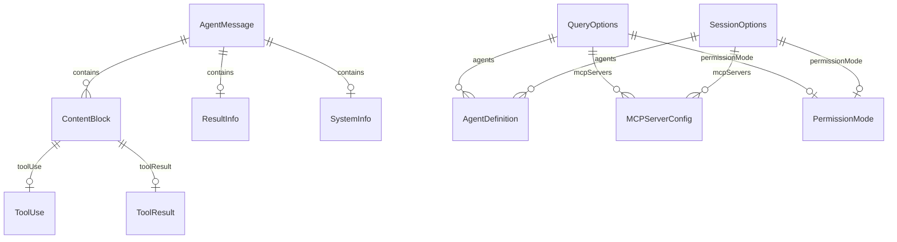
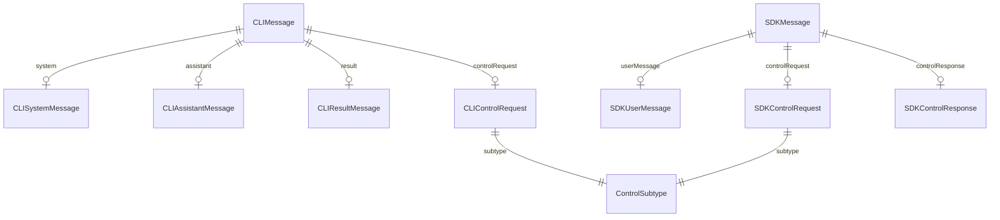

# データモデル

## Intent（意図）

SDK の公開型（Protocol Layer）と内部型（Concrete Layer）のデータモデルを定義する。
Swift の型安全性を活用し、不正な状態を型レベルで排除する設計を示す。

---

## 1. ER 図（型関係図）

### 1.1 Protocol Layer の型関係



### 1.2 Concrete Layer の内部型関係



---

## 2. Protocol Layer 型定義（AgentSDK モジュール）

### 2.1 AgentMessage

```swift
/// SDK が返すメッセージ型。バックエンド非依存の共通型。
public enum AgentMessage: Sendable, Codable {
    /// システム情報（ストリーム先頭）
    case system(SystemInfo)

    /// アシスタントの応答（完全なメッセージ）
    case assistant(AssistantInfo)

    /// アシスタントの部分応答（ストリーミング途中）
    case partial(PartialInfo)

    /// 最終結果（ストリーム末尾）
    case result(ResultInfo)
}
```

### 2.2 SystemInfo

```swift
public struct SystemInfo: Sendable, Codable, Hashable {
    /// セッション識別子
    public let sessionId: String

    /// 利用可能ツール一覧
    public let tools: [ToolInfo]

    /// 使用モデル ID
    public let model: String

    /// MCP サーバー情報
    public let mcpServers: [MCPServerInfo]
}

public struct ToolInfo: Sendable, Codable, Hashable {
    public let name: String
    public let description: String?
}

public struct MCPServerInfo: Sendable, Codable, Hashable {
    public let name: String
    public let status: String
}
```

### 2.3 AssistantInfo

```swift
public struct AssistantInfo: Sendable, Codable {
    /// コンテンツブロック（テキスト、ツール使用、ツール結果）
    public let content: [ContentBlock]

    /// サブエージェントのメッセージの場合、親ツール使用 ID
    public let parentToolUseId: String?
}
```

### 2.4 ContentBlock

```swift
public enum ContentBlock: Sendable, Codable {
    /// テキストブロック
    case text(String)

    /// ツール使用
    case toolUse(ToolUse)

    /// ツール結果
    case toolResult(ToolResult)
}

public struct ToolUse: Sendable, Codable {
    public let id: String
    public let name: String
    public let input: [String: JSONValue]
}

public struct ToolResult: Sendable, Codable {
    public let toolUseId: String
    public let content: String
    public let isError: Bool
}
```

### 2.5 JSONValue（JSON Schema / 任意 JSON 表現）

```swift
/// 任意の JSON 値を表現する型。
/// D-12 により外部依存なしで [String: Any] 相当を実現。
public enum JSONValue: Sendable, Codable, Hashable {
    case string(String)
    case number(Double)
    case integer(Int)
    case bool(Bool)
    case null
    case array([JSONValue])
    case object([String: JSONValue])
}
```

### 2.6 PartialInfo

```swift
public struct PartialInfo: Sendable, Codable {
    /// 部分コンテンツ（ストリーミング途中のテキスト断片等）
    public let content: [ContentBlock]
}
```

### 2.7 ResultInfo

```swift
public struct ResultInfo: Sendable, Codable {
    /// 最終テキスト結果
    public let result: String

    /// 累計コスト（USD）
    public let costUsd: Double

    /// 処理時間（ミリ秒）
    public let durationMs: Int

    /// 入力トークン数
    public let inputTokens: Int

    /// 出力トークン数
    public let outputTokens: Int

    /// セッション ID
    public let sessionId: String

    /// ターン数
    public let numTurns: Int
}
```

### 2.8 QueryOptions

```swift
public struct QueryOptions: Sendable {
    /// 使用モデル
    public var model: ModelSelection?

    /// システムプロンプト
    public var systemPrompt: String?

    /// 許可ツール一覧
    public var allowedTools: [String]?

    /// 拒否ツール一覧
    public var disallowedTools: [String]?

    /// サブエージェント定義
    public var agents: [String: AgentDefinition]?

    /// MCP サーバー設定
    public var mcpServers: [String: MCPServerConfig]?

    /// 権限モード
    public var permissionMode: PermissionMode?

    /// カスタム権限ハンドラ
    public var canUseTool: (@Sendable (String, [String: JSONValue], JSONValue?) async -> PermissionDecision)?

    /// 最大ターン数
    public var maxTurns: Int?

    /// コスト上限（USD）
    public var maxBudgetUsd: Double?

    /// 作業ディレクトリ
    public var cwd: String?

    /// 構造化出力スキーマ
    public var outputFormat: JSONValue?

    public init(/* all parameters with defaults */) { ... }
}
```

### 2.9 SessionOptions

```swift
public struct SessionOptions: Sendable {
    /// 使用モデル
    public var model: ModelSelection?

    /// システムプロンプト
    public var systemPrompt: String?

    /// 許可ツール一覧
    public var allowedTools: [String]?

    /// 拒否ツール一覧
    public var disallowedTools: [String]?

    /// サブエージェント定義
    public var agents: [String: AgentDefinition]?

    /// MCP サーバー設定
    public var mcpServers: [String: MCPServerConfig]?

    /// 権限モード
    public var permissionMode: PermissionMode?

    /// カスタム権限ハンドラ
    public var canUseTool: (@Sendable (String, [String: JSONValue], JSONValue?) async -> PermissionDecision)?

    /// 最大ターン数
    public var maxTurns: Int?

    /// コスト上限（USD）
    public var maxBudgetUsd: Double?

    /// 作業ディレクトリ
    public var cwd: String?

    public init(/* all parameters with defaults */) { ... }
}
```

### 2.10 補助型

```swift
public enum ModelSelection: Sendable, Codable, Hashable {
    case opus
    case sonnet
    case haiku
    case custom(String)

    /// CLI に渡す文字列値
    public var rawValue: String { ... }
}

public enum PermissionMode: String, Sendable, Codable {
    case `default` = "default"
    case acceptEdits = "acceptEdits"
    case bypassPermissions = "bypassPermissions"
    case plan = "plan"
}

public enum PermissionDecision: Sendable {
    case allow
    case deny(reason: String)
}

public struct AgentDefinition: Sendable, Codable {
    public let description: String
    public let prompt: String
    public let tools: [String]?
    public let model: ModelSelection?

    public init(description: String, prompt: String, tools: [String]? = nil, model: ModelSelection? = nil) {
        self.description = description
        self.prompt = prompt
        self.tools = tools
        self.model = model
    }
}

public struct MCPServerConfig: Sendable, Codable {
    public let command: String
    public let args: [String]?
    public let env: [String: String]?

    public init(command: String, args: [String]? = nil, env: [String: String]? = nil) {
        self.command = command
        self.args = args
        self.env = env
    }
}
```

---

## 3. エラー型

### 3.1 AgentSDKError

```swift
/// SDK の公開エラー型。
public enum AgentSDKError: Error, Sendable {
    /// CLI バイナリが見つからない
    case cliNotFound(searchedPaths: [String])

    /// JS ランタイム（Node.js / Bun / Deno）が見つからない
    case runtimeNotFound(runtime: String)

    /// CLI プロセスの起動に失敗
    case processLaunchFailed(underlying: Error)

    /// CLI プロセスが異常終了
    case processExited(exitCode: Int32, stderr: String)

    /// JSONL プロトコルエラー（不正 JSON、予期しないメッセージ）
    case protocolError(message: String, rawData: Data?)

    /// 初期化タイムアウト
    case initializationTimeout(seconds: Int)

    /// 制御リクエストタイムアウト
    case controlRequestTimeout(subtype: String, seconds: Int)

    /// セッションが期限切れ
    case sessionExpired(sessionId: String)

    /// セッションが既に閉じている
    case sessionClosed(sessionId: String)

    /// Transport が未接続
    case notConnected

    /// キャンセルされた
    case cancelled
}
```

### 3.2 エラーメッセージ品質（FR-040）

```swift
extension AgentSDKError: LocalizedError {
    public var errorDescription: String? {
        switch self {
        case .cliNotFound(let paths):
            return """
            Claude Code CLI not found.
            Searched paths: \(paths.joined(separator: ", "))
            Install: npm install -g @anthropic-ai/claude-agent-sdk
            """
        case .runtimeNotFound(let runtime):
            return "JavaScript runtime '\(runtime)' not found. Install Node.js 18+ or specify an alternative runtime."
        case .processExited(let code, let stderr):
            return "CLI process exited with code \(code). stderr: \(stderr)"
        // ... 他のケース
        }
    }
}
```

---

## 4. Concrete Layer 内部型（AgentSDKClaudeCode モジュール）

### 4.1 CLIMessage（CLI → SDK）

```swift
/// CLI から受信する raw JSONL メッセージ。internal 型。
internal enum CLIMessage: Decodable {
    case initializeReady
    case system(CLISystemMessage)
    case assistant(CLIAssistantMessage)
    case partialAssistant(CLIPartialAssistantMessage)
    case result(CLIResultMessage)
    case controlRequest(CLIControlRequest)
    case controlResponse(CLIControlResponse)
    case unknown(type: String)
}
```

### 4.2 SDKMessage（SDK → CLI）

```swift
/// SDK から CLI に送信する raw JSONL メッセージ。internal 型。
internal enum SDKMessage: Encodable {
    case userMessage(content: String)
    case controlRequest(SDKControlRequest)
    case controlResponse(SDKControlResponse)
}
```

---

## Rationale（根拠）

### AgentMessage を enum で定義

**決定:** メッセージ型を protocol ではなく enum で定義

**採用理由:**
- パターンマッチングで網羅性チェックが効く
- 値型のため copy-on-write でメモリ効率が良い
- 利用者が新しいケースを追加する必要がない（SDK 側で定義を管理）

### JSONValue 型の導入

**決定:** `[String: Any]` ではなく独自の `JSONValue` enum を使用

**採用理由:**
- `Any` は Sendable / Codable に準拠できない
- JSON の構造を型安全に表現できる
- Swift 6 の strict concurrency と整合

---

## 変更履歴

| 日付 | 変更内容 | 変更者 |
|------|---------|--------|
| 2026-02-08 | 初版作成 | Claude Code |
