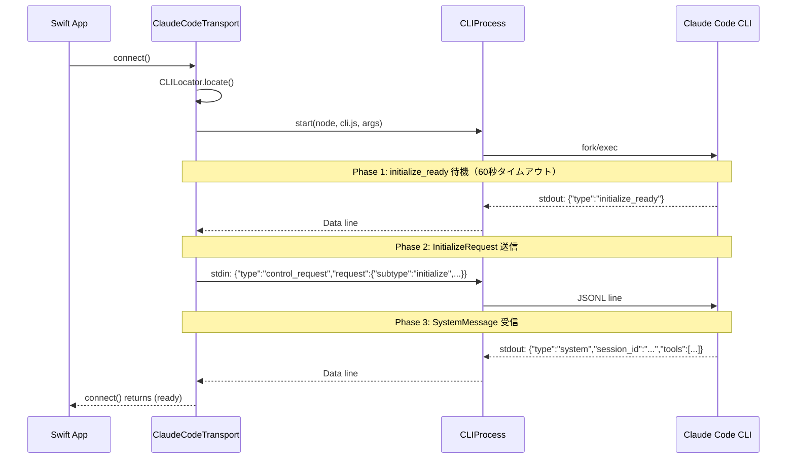
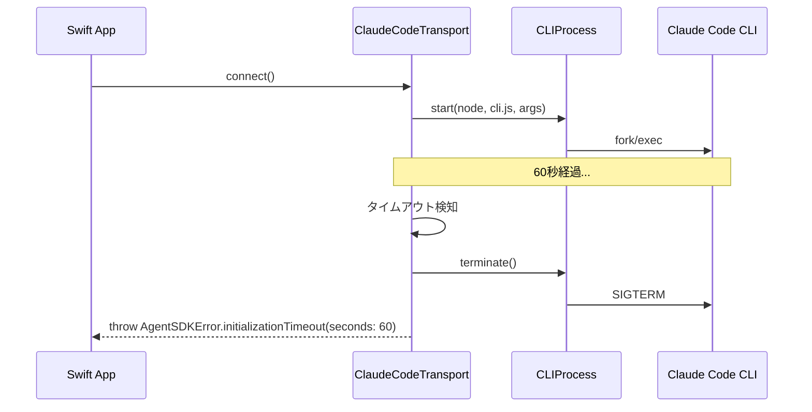
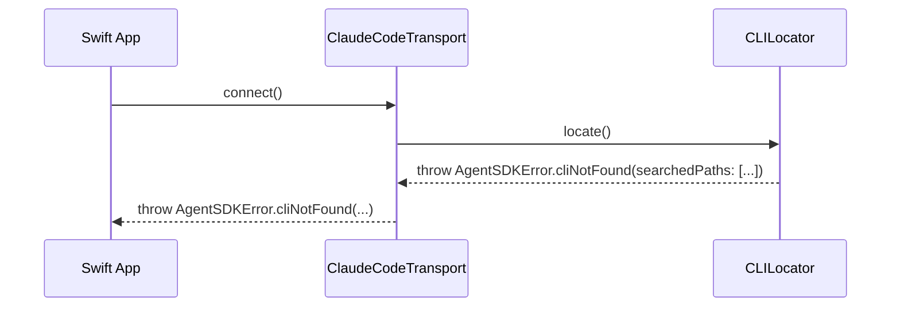
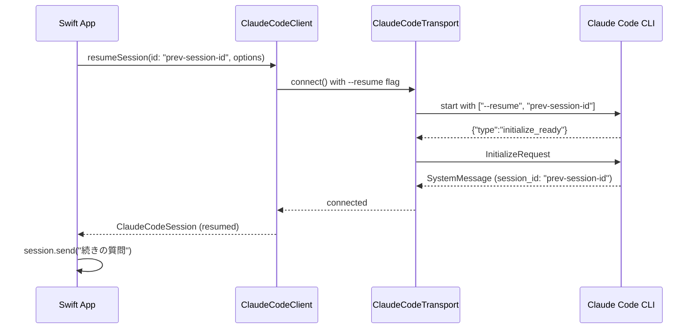
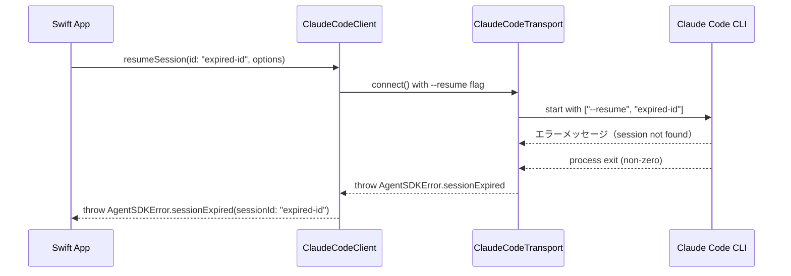
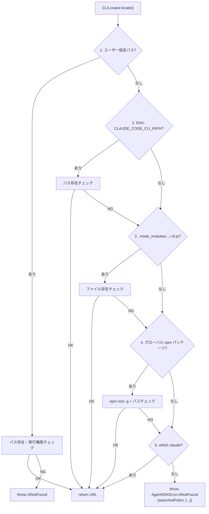

# 初期化・ハンドシェイクフロー

## Intent（意図）

本 SDK には認証フロー（ログイン等）は存在しない（認証は CLI が環境変数で行う）。
代わりに、CLI プロセスとの初期化ハンドシェイクフローを設計する。
このフローは SDK の最も重要なシーケンスであり、正確な実装が全機能の基盤となる。

---

## 1. ハンドシェイクフロー（FF-003）

### 1.1 正常系: 初回接続



### 1.2 異常系: タイムアウト



### 1.3 異常系: プロセス起動失敗



---

## 2. セッション再開フロー（FF-005: FR-020）

### 2.1 正常系: セッション再開



### 2.2 異常系: セッション期限切れ



---

## 3. CLI 探索フロー（FF-001: FR-001）

### 3.1 探索順序の詳細



---

## 4. InitializeRequest の構造

```swift
// SDK → CLI: 初期化リクエスト
{
    "type": "control_request",
    "request_id": "req_1_abc123",
    "request": {
        "subtype": "initialize",
        "supported_capabilities": ["mcp"],
        "hooks": []  // D-11: hooks は後回し
    }
}
```

---

## Rationale（根拠）

### ハンドシェイクを Transport 内部に隠蔽

**決定:** `connect()` メソッド内でハンドシェイク全体を実行し、完了後に返る

**採用理由:**
- 利用者がハンドシェイクの詳細を知る必要がない
- Protocol 層（AgentTransport）は「接続」という抽象のみを公開
- テスト時は MockTransport が即座に connected 状態を返す

---

## 変更履歴

| 日付 | 変更内容 | 変更者 |
|------|---------|--------|
| 2026-02-08 | 初版作成（認証フロー枠を初期化・ハンドシェイクフローに読み替え） | Claude Code |
