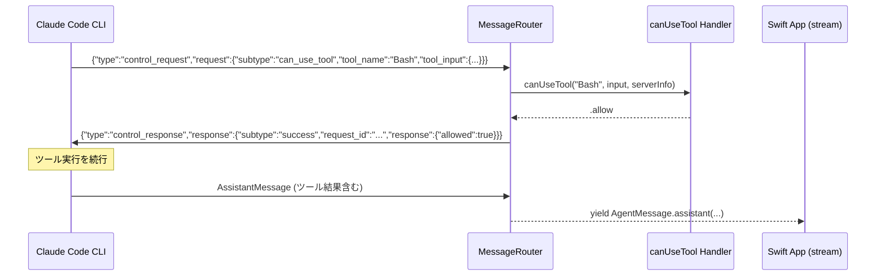
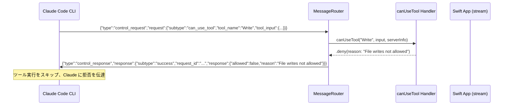
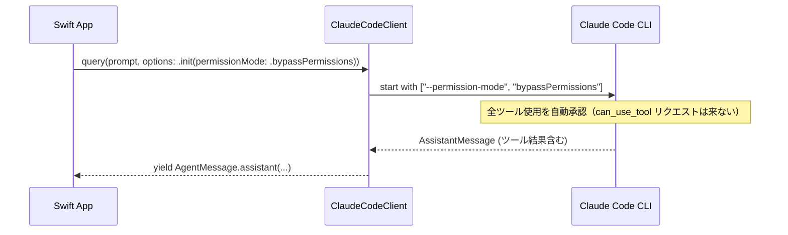
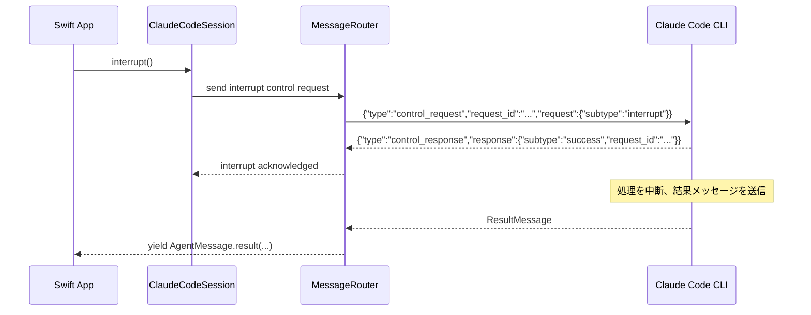
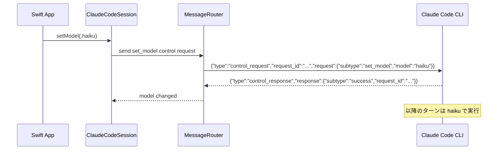

# 制御プロトコルフロー

## Intent（意図）

本 SDK には決済フローは存在しない。
代わりに、SDK ↔ CLI 間の双方向制御プロトコルフロー（権限ハンドリング、ランタイム制御等）を設計する。
制御メッセージの request/response パターンと、カスタム権限ハンドラの動作を明確にする。

---

## 1. 権限ハンドリングフロー（FF-006）

### 1.1 カスタム権限ハンドラ: 許可



### 1.2 カスタム権限ハンドラ: 拒否



### 1.3 権限モード使用時（カスタムハンドラなし）



---

## 2. ランタイム制御フロー（FF-009）

### 2.1 クエリ中断（FR-034）



### 2.2 ランタイムモデル変更（FR-035）



---

## 3. 制御メッセージのリクエスト/レスポンス管理

### 3.1 request_id 生成

```swift
// MessageRouter 内部
private var requestCounter: UInt64 = 0

func nextRequestId() -> String {
    requestCounter += 1
    let hex = String(UInt32.random(in: 0...UInt32.max), radix: 16)
    return "req_\(requestCounter)_\(hex)"
}
```

### 3.2 Pending リクエスト管理

```swift
// MessageRouter Actor 内部
private var pendingRequests: [String: CheckedContinuation<CLIControlResponse, Error>] = [:]

func sendControlRequest(_ request: SDKControlRequest) async throws -> CLIControlResponse {
    let requestId = nextRequestId()
    return try await withCheckedThrowingContinuation { continuation in
        pendingRequests[requestId] = continuation
        // write request to transport
    }
}

func handleControlResponse(_ response: CLIControlResponse) {
    guard let continuation = pendingRequests.removeValue(forKey: response.requestId) else {
        return // unknown request_id, ignore
    }
    continuation.resume(returning: response)
}
```

### 3.3 タイムアウト処理

```swift
func sendControlRequest(_ request: SDKControlRequest, timeout: Duration = .seconds(30)) async throws -> CLIControlResponse {
    try await withThrowingTaskGroup(of: CLIControlResponse.self) { group in
        group.addTask {
            // actual request
            return try await self.actualSend(request)
        }
        group.addTask {
            // timeout
            try await Task.sleep(for: timeout)
            throw AgentSDKError.controlRequestTimeout(subtype: request.subtype, seconds: Int(timeout.components.seconds))
        }
        let result = try await group.next()!
        group.cancelAll()
        return result
    }
}
```

---

## 4. 制御サブタイプ一覧

| サブタイプ | 方向 | 用途 | タイムアウト |
|-----------|------|------|------------|
| `initialize` | SDK→CLI | ハンドシェイク | 60 秒 |
| `interrupt` | SDK→CLI | 処理中断 | 30 秒 |
| `can_use_tool` | CLI→SDK | ツール使用許可確認 | - (SDK が応答) |
| `set_permission_mode` | SDK→CLI | 権限モード変更 | 30 秒 |
| `set_model` | SDK→CLI | モデル変更 | 30 秒 |
| `rewind_files` | SDK→CLI | ファイル巻き戻し | 30 秒 |
| `get_account_info` | SDK→CLI | アカウント情報 | 30 秒 |
| `get_models` | SDK→CLI | モデル一覧 | 30 秒 |
| `get_commands` | SDK→CLI | コマンド一覧 | 30 秒 |
| `get_mcp_server_status` | SDK→CLI | MCP 状態 | 30 秒 |
| `set_mcp_servers` | SDK→CLI | MCP 設定変更 | 30 秒 |

---

## Rationale（根拠）

### CheckedContinuation による制御レスポンス待機

**決定:** pending リクエストを `CheckedContinuation` で管理し、レスポンス受信時に resume

**採用理由:**
- Swift Concurrency のネイティブなブリッジ機構
- `CheckedContinuation` はデバッグビルドで二重 resume を検出
- Actor 内で状態を安全に管理できる

### TaskGroup によるタイムアウト実装

**決定:** `withThrowingTaskGroup` で実リクエストとタイムアウト Task を競争

**採用理由:**
- Swift Concurrency の構造化並行性に沿った実装
- キャンセル伝播が自動的に行われる
- `Task.sleep` は CancellationError を正しく throw する

---

## 変更履歴

| 日付 | 変更内容 | 変更者 |
|------|---------|--------|
| 2026-02-08 | 初版作成（決済フロー枠を制御プロトコルフローに読み替え） | Claude Code |
