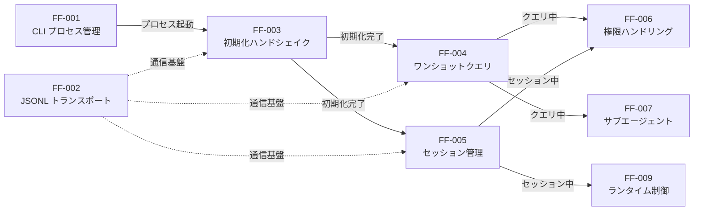
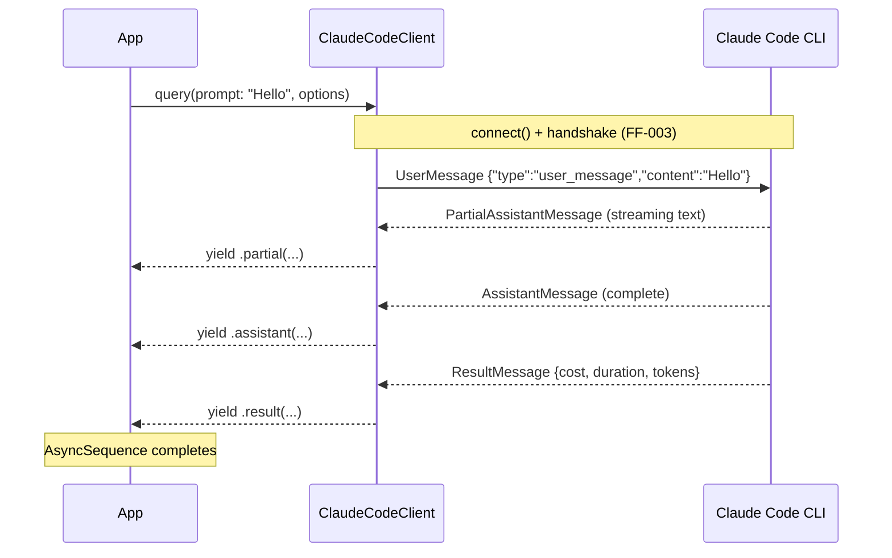
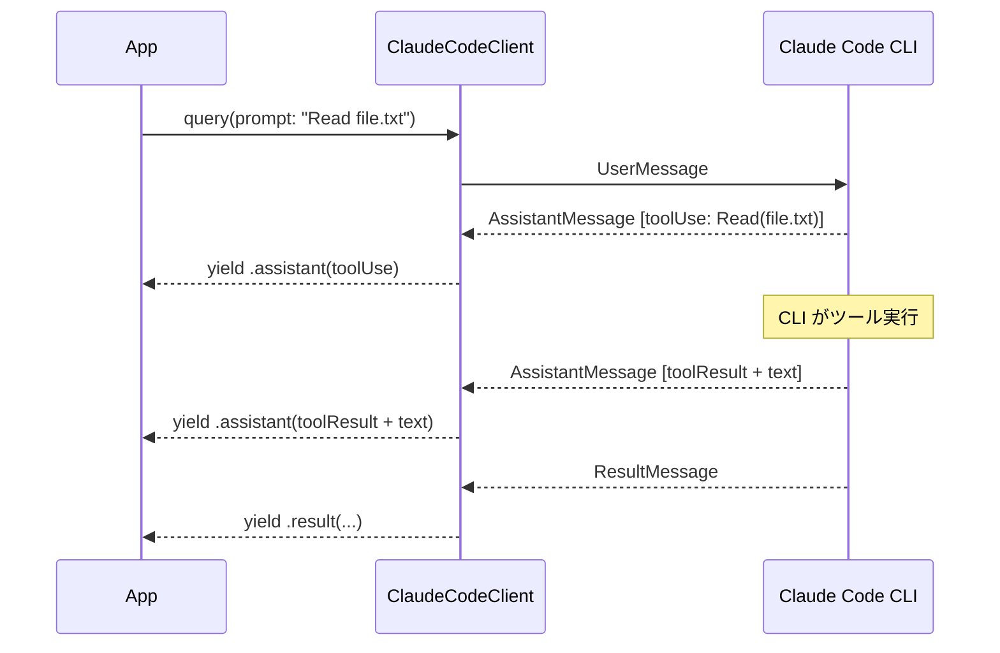
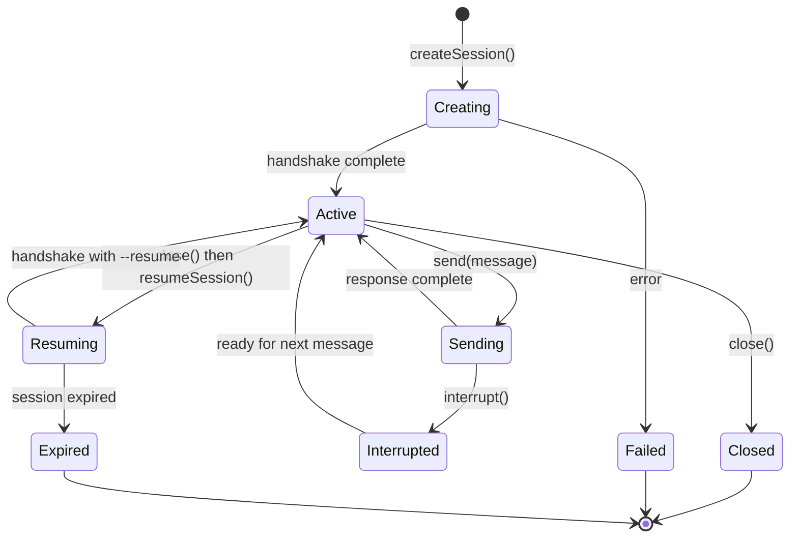
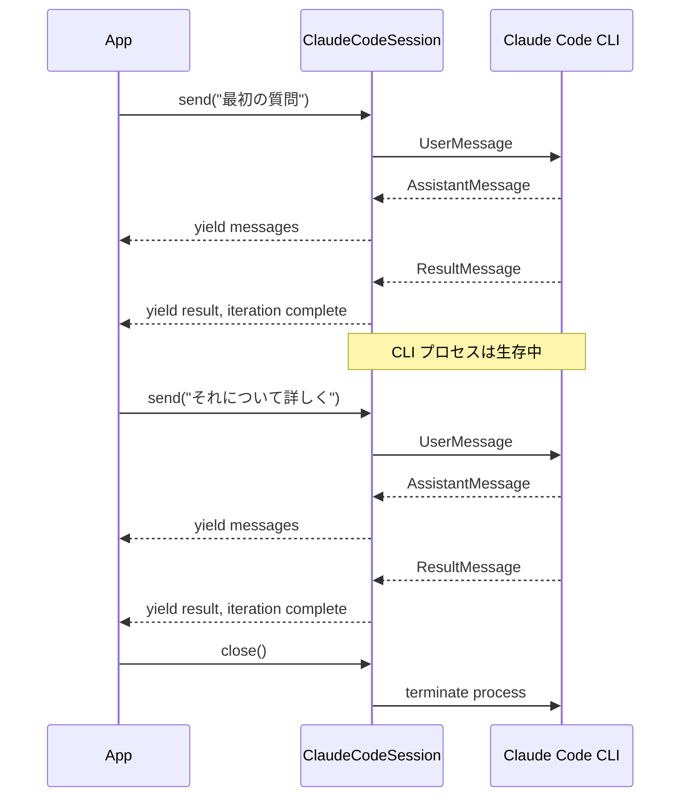
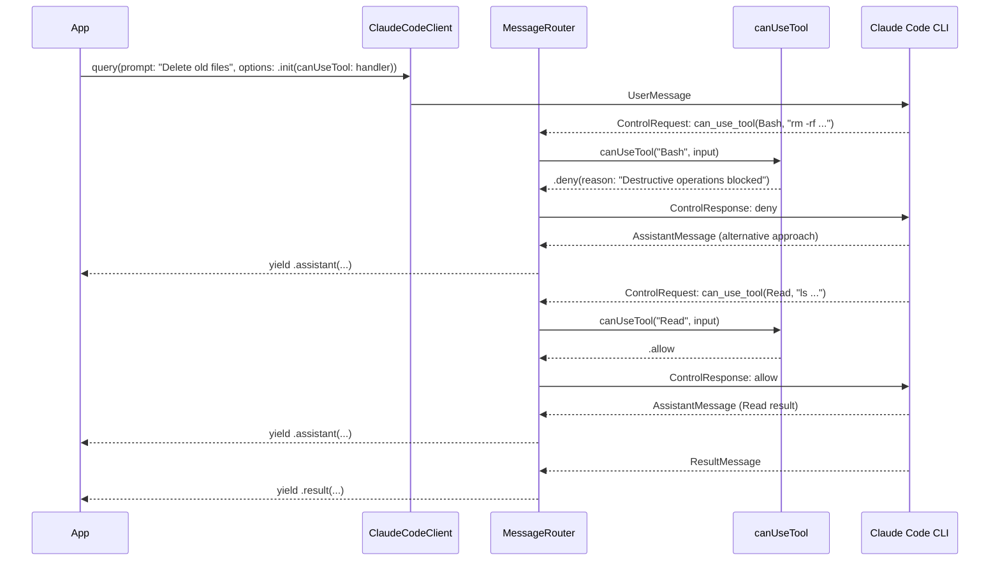
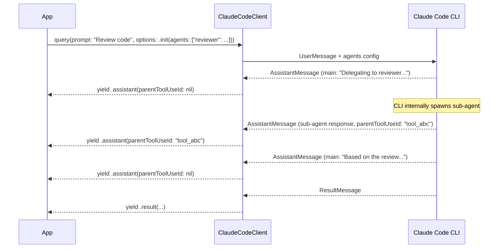
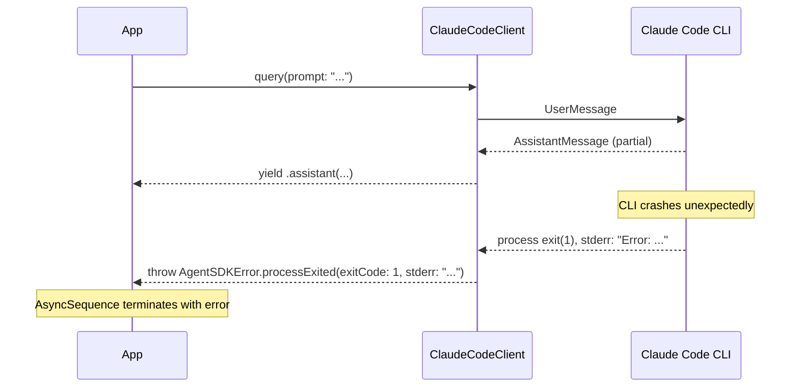
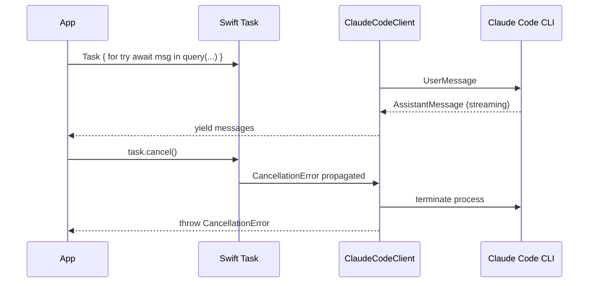

# メッセージフロー設計

## Intent（意図）

本 SDK には画面遷移は存在しない（ライブラリ SDK のため）。
代わりに、各 Feature Flow（FF）のメッセージフローを設計する。
利用者と CLI の間を流れるメッセージの順序・種別・条件を明確にする。

---

## 1. メッセージフロー Overview

---

## 2. FF-004: ワンショットクエリフロー

### 2.1 正常系: テキスト応答

### 2.2 正常系: ツール使用を含む応答

---

## 3. FF-005: セッション管理フロー

### 3.1 セッションライフサイクル

### 3.2 セッション内の複数メッセージ交換

---

## 4. FF-006: 権限ハンドリングフロー

### 4.1 カスタム権限ハンドラの介入

---

## 5. FF-007: サブエージェントフロー

### 5.1 サブエージェントのメッセージフロー

---

## 6. FF-010: エラーハンドリングフロー

### 6.1 プロセス異常終了

### 6.2 キャンセレーション

---

## Rationale（根拠）

### メッセージフロー図を FF 単位で分割

**決定:** 各 FF につき独立したシーケンス図を作成

**採用理由:**
- 1 つの図にすべてのフローを含めるとノード数が 50 を超える
- FF 単位の分割により、各フローの詳細が読みやすい
- spec-writing ルールの FF 単位分割に準拠

---

## 変更履歴

| 日付 | 変更内容 | 変更者 |
|------|---------|--------|
| 2026-02-08 | 初版作成（画面遷移図枠をメッセージフロー設計に読み替え） | Claude Code |
