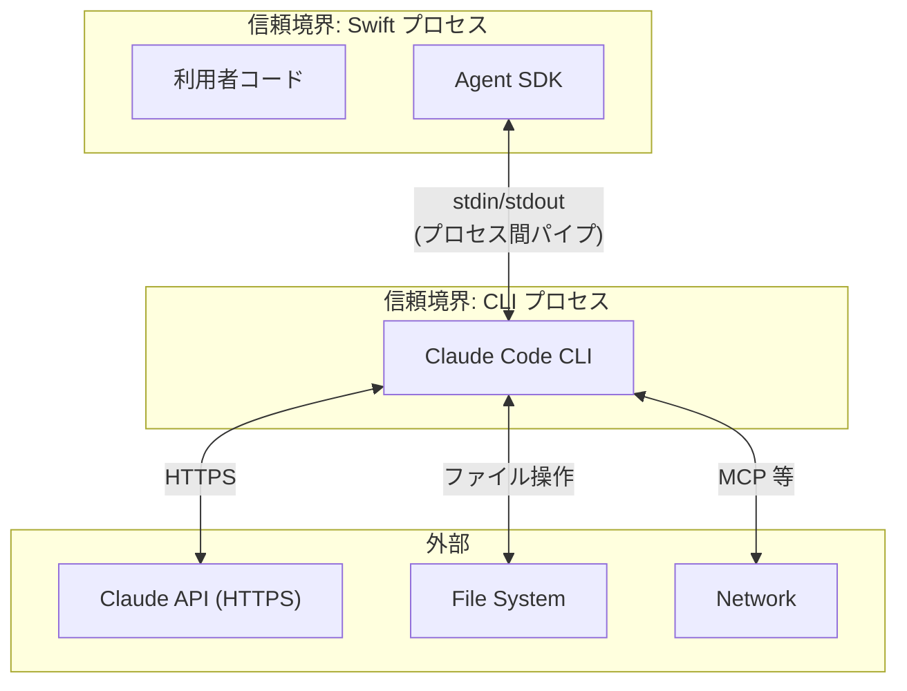

# セキュリティ設計

## Intent（意図）

SDK のセキュリティ境界と脅威モデルを定義する。
SDK は CLI プロセスのラッパーであるため、セキュリティの大部分は CLI 側に委ねるが、
SDK 固有のセキュリティ考慮事項を明確にする。

---

## 1. セキュリティ境界



### 1.1 SDK の責務範囲

| 責務 | SDK | CLI |
|------|-----|-----|
| 認証管理 | 扱わない | CLI が OAuth トークンキャッシュを使用（サブスクリプション認証） |
| HTTPS 通信 | 行わない | Claude API との通信を担当 |
| ファイル操作 | 行わない | ツール実行で操作 |
| 権限制御 | canUseTool ハンドラの呼び出し | ツール実行可否の最終判断 |
| プロセス間通信 | stdin/stdout パイプ | stdin/stdout パイプ |

---

## 2. 脅威モデル

### 2.1 対象とする脅威

| 脅威 | 影響度 | 対策 |
|------|--------|------|
| CLI プロセスの意図しない権限昇格 | 高 | CLI プロセスは呼び出し元と同一権限で実行（権限昇格しない） |
| 認証情報の漏洩 | 高 | SDK は認証情報を保持・記録しない。CLI が OAuth トークンキャッシュを使用 |
| stdin/stdout の傍受 | 中 | プロセス間パイプは OS レベルで保護。第三者プロセスからのアクセスは OS のプロセス分離に依存 |
| 不正な JSONL メッセージの注入 | 中 | stdin はパイプ経由のみ。外部からの書き込み不可 |
| CLI プロセスの悪意ある動作 | 低 | CLI は npm パッケージとしてユーザーが明示的にインストール。信頼の判断はユーザーに委ねる |

### 2.2 対象としない脅威

| 脅威 | 理由 |
|------|------|
| ネットワーク上の中間者攻撃 | CLI が HTTPS で Claude API と通信。SDK の責務外 |
| Claude API の脆弱性 | Anthropic 側の責務 |
| ファイルシステムの改ざん | CLI のツール実行に関わる問題。SDK は直接ファイル操作しない |

---

## 3. セキュリティ設計方針

### 3.1 認証情報の取り扱い

**前提:** 本 SDK はサブスクリプション認証（Claude Pro/Max/Team）を前提とする。
利用者は事前に `claude login` で OAuth 認証を完了しておく。API Key 認証は想定しない。

```swift
// NG: SDK が認証情報を受け取る
// let sdk = AgentSDK(apiKey: "sk-...")  // これは行わない

// OK: CLI が OAuth トークンキャッシュから認証情報を読み取る
// 利用者が事前に `claude login` を実行しておく
// SDK は認証情報に一切関与しない
```

- SDK は認証情報（API Key、OAuth トークン等）をプロパティ/パラメータとして受け取らない
- SDK は認証情報をログ/エラーメッセージに含めない
- CLI プロセスは自身の認証トークンキャッシュ（`claude login` で保存されたもの）を使用する

### 3.2 プロセス権限

- CLI プロセスは `setuid` / `setgid` を行わない
- SDK は `Process.executableURL` にユーザーが指定した or 自動検出したパスを設定
- 環境変数の `PATH` 操作は行わない（ユーザー環境をそのまま使用）

### 3.3 入力バリデーション

| バリデーション対象 | チェック内容 |
|-------------------|------------|
| CLI パス | ファイル存在確認 + 実行権限確認 |
| ランタイムパス | `which` コマンドで解決 |
| JSONL 受信データ | `JSONDecoder` で厳密にデコード。不正 JSON はプロトコルエラー |
| 制御メッセージの request_id | pending リクエストとの照合。未知の ID は無視 |

### 3.4 リソースクリーンアップ

- CLI プロセスは `deinit` / `Task.cancel()` で確実に終了
- 終了しないプロセスには SIGTERM → SIGKILL の段階的終了
- ファイルハンドル（Pipe）はプロセス終了時に自動解放

---

## 4. 権限ハンドリングの安全設計

### 4.1 canUseTool ハンドラの実行保証

```swift
// カスタムハンドラがクラッシュした場合
options.canUseTool = { toolName, input, serverInfo in
    // ハンドラ内で throw された場合
    fatalError("bug") // ← これが起きた場合
}

// SDK の対応:
// 1. ハンドラは async throws ではなく async のみ（throw 不可）
// 2. ハンドラの戻り値は .allow / .deny の二択（デフォルトは .deny）
// 3. ハンドラがタイムアウトした場合も .deny として扱う
```

### 4.2 権限モードのデフォルト

- `permissionMode` 未指定時は `.default`（各ツール使用時に確認）
- `.bypassPermissions` は利用者が明示的に指定した場合のみ有効
- SDK はデフォルトで安全側に倒す

---

## Rationale（根拠）

### SDK が認証情報を扱わない設計

**決定:** SDK は認証情報（API Key、OAuth トークン等）を一切パラメータとして受け取らず、CLI の認証機構に委ねる

**採用理由:**
- SDK に認証情報が渡ると、メモリダンプ・ログ・エラーメッセージ等で漏洩リスクが増加
- サブスクリプション認証（`claude login`）による OAuth トークン管理は CLI の責務
- 責務分離: 認証は CLI の責務。SDK は通信のみに専念

### デフォルト deny の原則

**決定:** canUseTool ハンドラの異常時はデフォルトで deny

**採用理由:**
- セキュリティの原則: fail-safe defaults
- 意図しないツール実行を防止
- 利用者が明示的に allow した場合のみツール実行を許可

---

## 変更履歴

| 日付 | 変更内容 | 変更者 |
|------|---------|--------|
| 2026-02-08 | 初版作成 | Claude Code |
