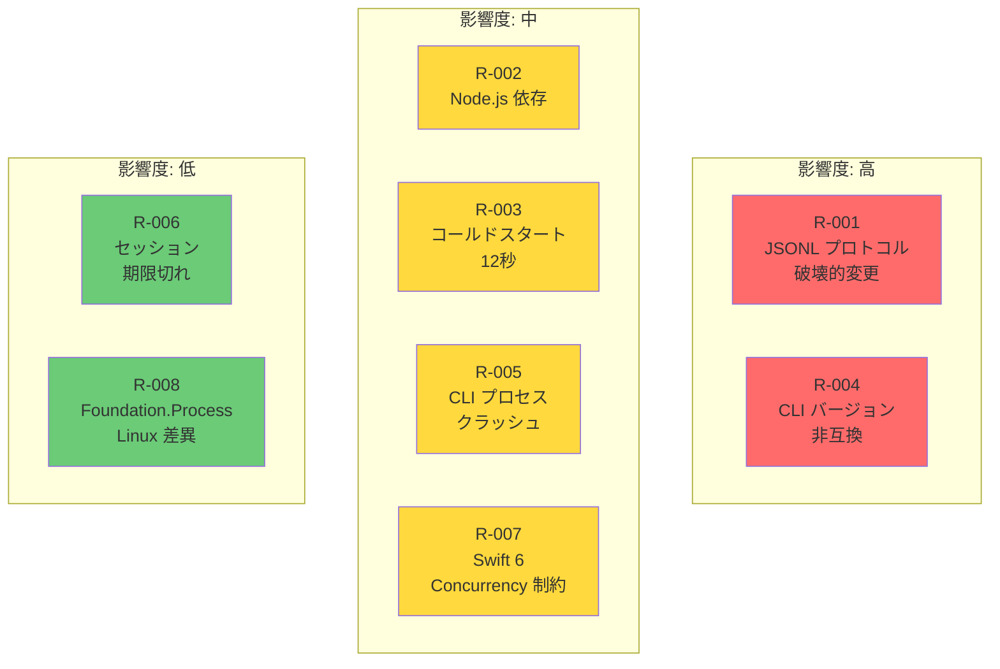

# 技術リスク・対策

## Intent（意図）

SDK 開発・運用における技術リスクを特定し、具体的な対策と受容基準を定義する。
リスクの発生確率と影響度に基づいて優先順位を付け、実装フェーズでの対応計画を示す。

---

## 1. リスクマトリクス

---

## 2. リスク詳細

### R-001: JSONL プロトコルの破壊的変更

| 項目 | 内容 |
|------|------|
| **深刻度** | 高 |
| **発生確率** | 中 |
| **影響** | SDK が CLI と通信できなくなり、全機能が停止する |
| **対策** | |
| 1. CLI バージョンロック | `@anthropic-ai/claude-agent-sdk` のバージョンを SDK リリースごとに固定 |
| 2. プロトコル互換性テスト | 実 CLI との統合テストを CI で定期実行（D-16） |
| 3. 未知メッセージの無視 | 新しいメッセージタイプは無視し、既知のメッセージのみ処理（前方互換性） |
| 4. バージョンマッピング | SDK バージョンと CLI バージョンの対応表を README で公開 |
| **受容基準** | 1 バージョンの遅延で追従可能（CLI リリース後 1 週間以内に SDK を更新） |
| **検知方法** | CI の統合テスト失敗、GitHub Actions の定期テスト |

### R-002: Node.js ランタイム依存

| 項目 | 内容 |
|------|------|
| **深刻度** | 中 |
| **発生確率** | 確定（設計上の制約） |
| **影響** | Node.js がインストールされていない環境では SDK が動作しない |
| **対策** | |
| 1. 明示的なエラーメッセージ | Node.js 未検出時にインストール方法を含むエラーを表示 |
| 2. 代替ランタイムサポート | Bun / Deno を代替として選択可能にする |
| 3. セットアップドキュメント | 前提条件を README 冒頭で明記 |
| **受容基準** | 制約として受容。利用者が Node.js をインストールする前提 |

### R-003: コールドスタート 12 秒

| 項目 | 内容 |
|------|------|
| **深刻度** | 中 |
| **発生確率** | 確定（CLI の特性） |
| **影響** | 初回クエリの応答が遅い。UX に影響 |
| **対策** | |
| 1. セッション維持（D-10） | V2 API でセッションを維持し、2 回目以降はコールドスタートなし |
| 2. ドキュメント | パフォーマンス特性を文書化し、セッション維持を推奨 |
| 3. 将来: プリウォーミング | D-15 により現スコープ外だが、将来の別パッケージとして検討可能 |
| **受容基準** | セッション再利用時は 50ms 以内のオーバーヘッドで許容 |

### R-004: CLI バージョン非互換

| 項目 | 内容 |
|------|------|
| **深刻度** | 高 |
| **発生確率** | 中 |
| **影響** | SDK とユーザーの CLI バージョンが不一致の場合、予期しない動作やエラーが発生 |
| **対策** | |
| 1. バージョン検証 | 初期化時に CLI バージョンを確認し、非互換の場合は警告/エラー |
| 2. バージョンマッピング表 | SDK の各バージョンに対応する CLI バージョンを明示 |
| 3. Graceful degradation | 可能な限り後方互換性を維持し、未知の機能のみスキップ |
| **受容基準** | SDK が対応する CLI バージョン範囲を明確に定義 |

### R-005: CLI プロセスクラッシュ

| 項目 | 内容 |
|------|------|
| **深刻度** | 中 |
| **発生確率** | 低 |
| **影響** | 実行中のクエリ/セッションが異常終了する |
| **対策** | |
| 1. `terminationHandler` | プロセス終了を確実に検知 |
| 2. エラー伝播 | exit code + stderr をエラーに含め、利用者が原因を特定可能にする |
| 3. リソースクリーンアップ | プロセスクラッシュ時も Pipe / FileHandle を確実に解放 |
| **受容基準** | クラッシュ検知率 100%、リソースリーク 0 件 |

### R-006: セッション期限切れ

| 項目 | 内容 |
|------|------|
| **深刻度** | 低 |
| **発生確率** | 中 |
| **影響** | 非活動 10 分後にセッションが失効し、再接続が必要 |
| **対策** | |
| 1. 明確なエラー型 | `AgentSDKError.sessionExpired` で利用者に通知 |
| 2. ドキュメント | セッション有効期限を文書化 |
| 3. 将来: 自動再接続 | 現スコープでは手動再接続。将来的に自動再接続を検討 |
| **受容基準** | 利用者がエラーハンドリングで対応可能 |

### R-007: Swift 6 Concurrency 制約

| 項目 | 内容 |
|------|------|
| **深刻度** | 中 |
| **発生確率** | 低 |
| **影響** | strict concurrency checking によるコンパイルエラー、設計変更の必要性 |
| **対策** | |
| 1. 全型 Sendable 準拠 | 設計段階から Sendable を意識 |
| 2. Actor の活用 | 可変状態は Actor で保護 |
| 3. `@Sendable` クロージャ | canUseTool ハンドラ等のクロージャに `@Sendable` を要求 |
| **受容基準** | Swift 6 strict concurrency で warning 0 |

### R-008: Foundation.Process の Linux 差異

| 項目 | 内容 |
|------|------|
| **深刻度** | 低 |
| **発生確率** | 中（D-13 により現時点では影響なし） |
| **影響** | Linux 対応時に Foundation.Process の動作差異が問題になる可能性 |
| **対策** | |
| 1. macOS 優先（D-13） | 初期リリースは macOS のみ |
| 2. 条件コンパイル | `#if os(Linux)` で Linux 固有の処理を分離 |
| 3. Docker テスト | Linux 対応時は Docker ベースの CI を追加 |
| **受容基準** | macOS での安定動作を優先。Linux は後日対応 |

---

## 3. リスク対応スケジュール

| リスク | 対応フェーズ | 優先度 |
|--------|------------|--------|
| R-001 | Phase 1-2（Transport + Client 実装時） | 最優先 |
| R-002 | Phase 1（CLILocator 実装時） | 高 |
| R-003 | Phase 3（Session 実装時） | 高 |
| R-004 | Phase 1-2（初期化実装時） | 高 |
| R-005 | Phase 1（CLIProcess 実装時） | 高 |
| R-006 | Phase 3（Session 実装時） | 中 |
| R-007 | 全フェーズ | 継続的 |
| R-008 | 将来フェーズ | 低 |

---

## 4. 検討事項（未決定）

| 項目 | 内容 | 判断時期 |
|------|------|---------|
| CLI バージョン自動検出 | `cli.js --version` 出力のパース方法 | Phase 1 実装時 |
| 自動リトライ戦略 | プロセスクラッシュ時の自動再起動回数/間隔 | Phase 3 実装時 |
| プロトコル変更の検知方法 | CLI の git tag / npm version の自動監視 | 運用開始後 |

---

## Rationale（根拠）

### テスト駆動でのプロトコル検証（D-16）

**決定:** JSONL プロトコルの仕様は事前に完全定義せず、テスト駆動で検証する

**採用理由:**
- プロトコルは非公開内部仕様であり、ドキュメントが存在しない
- 実 CLI との統合テストが最も信頼性の高い検証方法
- Go SDK の先行実装がプロトコルの逆算可能性を実証済み
- テスト失敗時に不整合を即座に検出・修正できる

---

## 変更履歴

| 日付 | 変更内容 | 変更者 |
|------|---------|--------|
| 2026-02-08 | 初版作成 | Claude Code |
