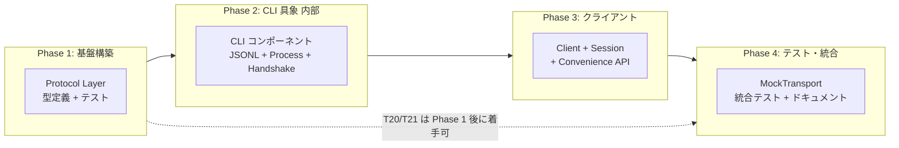
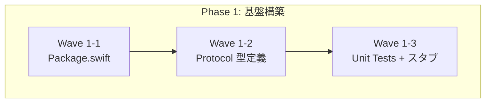
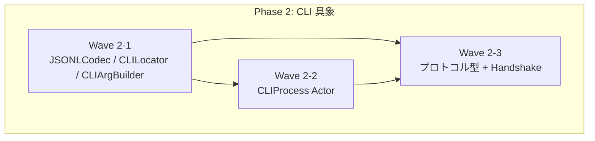
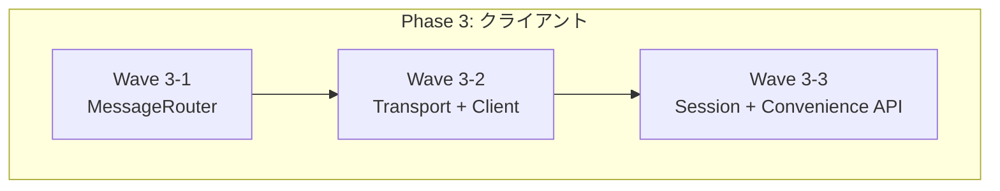
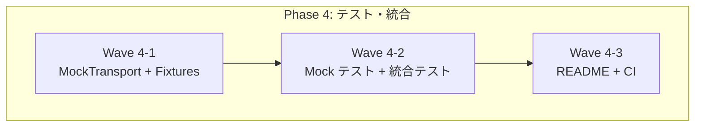
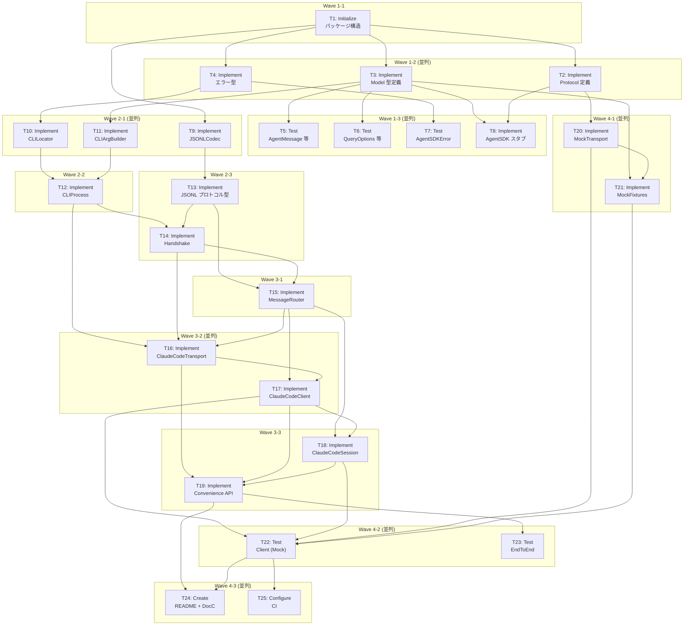
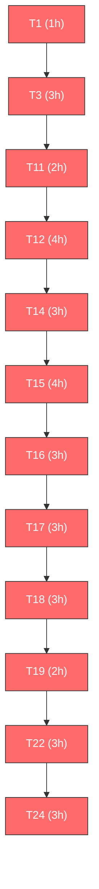

# 依存関係 Mermaid 図

## 1. Phase 間依存関係図

---

## 2. Wave 間依存関係図

### Phase 1

### Phase 2

### Phase 3

### Phase 4

---

## 3. Task 間依存関係図（全体）

---

## 4. クリティカルパス（ハイライト）

**クリティカルパス合計: 34h**

---

## 変更履歴

| 日付 | 変更内容 | 変更者 |
|------|---------|--------|
| 2026-02-08 | 初版作成 | Claude Code |
